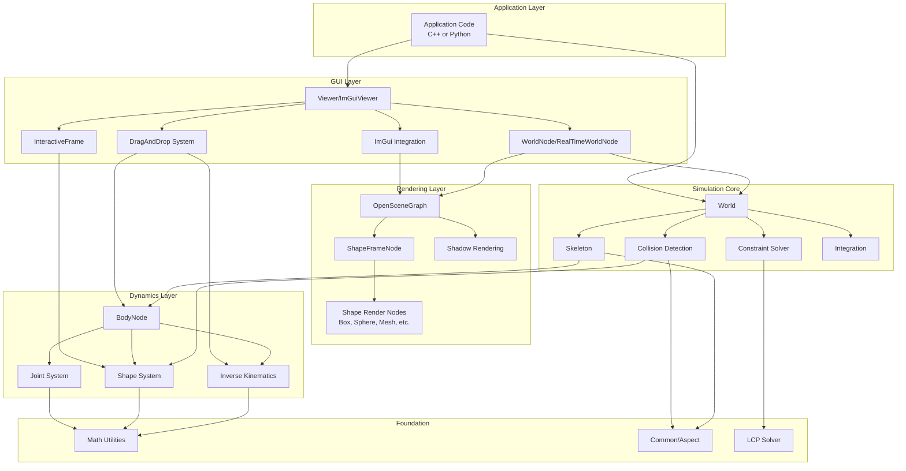

# DART GUI - Developer Onboarding Guide

## Documentation Principles

**Onboarding docs should**:

- ✅ Explain **design decisions** and **why** (not just what)
- ✅ Point to **code as source of truth** (CMakeLists.txt, pixi.toml, source files)
- ✅ Focus on **current state**, not history
- ❌ Avoid hardcoded lists (dependencies, file lists, versions) that become outdated
- ❌ Avoid repeating what's obvious from reading the code

**When information changes frequently** → Point to authoritative source
**When explaining architecture** → Focus on relationships and design decisions

## 1. Overview

**DART** (Dynamic Animation and Robotics Toolkit) is a comprehensive C++ physics engine for robotics simulation, kinematics, dynamics, and control. The **dart_gui** component provides 3D visualization and interactive manipulation capabilities built on OpenSceneGraph (OSG) and Dear ImGui.

### Documentation Principles

**This documentation prioritizes the codebase as the source of truth:**

- Minimal code snippets (prefer links to actual source)
- Avoid details that can become outdated or out-of-sync
- Focus on concepts, patterns, and architecture
- Direct readers to the code for specifics

### Design Principles

**Prefer simplicity over premature generalization:**

- Start with the simplest solution that solves the current problem
- Only add abstraction, hierarchy, or scalability when actually needed
- Resist the urge to design for hypothetical future requirements
- Refactor to add complexity when pain points emerge, not before
- Example: `helpers/common_helpers.hpp` not `helpers/common/test_helpers.hpp` - flat structure is simpler until we have enough helpers to warrant deeper nesting

### Documentation Structure

This onboarding guide is organized into several focused documents:

- **[README.md](README.md)** (this file) - Architecture overview and common workflows
- **[building.md](building.md)** - Step-by-step build instructions for all platforms
- **[contributing.md](contributing.md)** - Comprehensive contribution workflow and guidelines
- **[code-style.md](code-style.md)** - Code style conventions for C++, Python, and CMake
- **[testing.md](testing.md)** - Test suite organization, unit vs integration tests, running tests
- **[ci-cd.md](ci-cd.md)** - CI/CD workflows, caching strategies, and performance optimization
- **[architecture.md](architecture.md)** - Deep dive into DART's simulation core
- **[dynamics.md](dynamics.md)** - Articulated body system and kinematics
- **[gui-rendering.md](gui-rendering.md)** - OpenSceneGraph integration details
- **[python-bindings.md](python-bindings.md)** - nanobind bindings architecture
- **[api-documentation.md](api-documentation.md)** - Publishing strategy for RTD and GitHub Pages API docs
- **[build-system.md](build-system.md)** - CMake internals and dependency analysis

### Purpose and Problem Solved

DART addresses the need for:

- **High-fidelity physics simulation** for articulated rigid and soft body systems
- **Efficient algorithms** - O(n) complexity for forward/inverse dynamics using Featherstone algorithms
- **Interactive 3D visualization** for robotics research and development
- **Python integration** for rapid prototyping and machine learning workflows
- **Research-grade tooling** maintained by the robotics community and Meta employee Jeongseok Lee

### Key Features

- **Advanced Dynamics**: Articulated body simulation with 10+ joint types, contact resolution, constraint solving
- **Multiple Collision Backends**: FCL (default), Bullet, DART native, ODE
- **3D Visualization**: OpenSceneGraph-based rendering with shadows, materials, and real-time updates
- **Interactive Manipulation**: Drag-and-drop, inverse kinematics, interactive frames with visual handles
- **ImGui Integration**: Modern immediate-mode GUI for controls, debugging, and custom widgets
- **Python Bindings**: Complete API coverage via nanobind with NumPy integration
- **Optimization Helpers**: Core repo ships gradient-descent + IK primitives; the heavy-duty solver suite (IPOPT, NLopt, pagmo, SNOPT) now lives in [dart-optimization](https://github.com/dartsim/dart-optimization)
- **File Format Support**: URDF, SDF, SKEL, MJCF for robot model loading (SKEL is legacy XML-only; prefer URDF/SDF/MJCF for new work)
- **Cross-Platform**: Linux, macOS (Intel/ARM), Windows

> Related projects: motion-planning helpers now reside in [dart-planning](https://github.com/dartsim/dart-planning) and the advanced optimizer suite lives in [dart-optimization](https://github.com/dartsim/dart-optimization). This repository focuses on the simulation core plus lightweight gradient-descent utilities.

### Technologies Used

| Category                | Technology            | Purpose                   |
| ----------------------- | --------------------- | ------------------------- |
| **Core Language**       | C++17                 | Main implementation       |
| **Build System**        | CMake 3.22.1+         | Cross-platform builds     |
| **Python Bindings**     | nanobind 2.9.x        | Python API                |
| **Linear Algebra**      | Eigen 3.4.0+          | Math operations           |
| **Collision Detection** | FCL 0.7.0+            | Primary collision backend |
| **3D Rendering**        | OpenSceneGraph 3.0.0+ | Visualization             |
| **GUI Framework**       | Dear ImGui 1.91.9     | Immediate-mode UI         |
| **Model Loading**       | assimp 5.4.3+         | 3D asset import           |
| **Environment**         | pixi/conda-forge      | Dependency management     |
| **Graphics API**        | OpenGL 2+             | Rendering backend         |

---

## 2. High-Level Architecture Diagram



### Component Explanations

**Application Layer:**

- Entry point for user code (examples, tutorials, custom applications)
- Can be written in C++ or Python (via dartpy bindings)

**GUI Layer:**

- **Viewer**: Main window manager for 3D visualization with camera control and event handling
- **ImGuiViewer**: Extended viewer with Dear ImGui widget support for interactive UI
- **WorldNode/RealTimeWorldNode**: Bridge between DART World and OSG scene graph, handles real-time simulation
- **DragAndDrop**: Interactive manipulation system with constraint support
- **InteractiveFrame**: Visual 3D manipulator with translation/rotation handles

**Rendering Layer:**

- **OpenSceneGraph (OSG)**: Scene graph management and OpenGL rendering
- **ShapeFrameNode**: Converts DART frames to OSG nodes
- **Shape Render Nodes**: Specialized renderers for 16+ shape types (box, sphere, mesh, etc.)
- **Shadow Rendering**: Configurable shadow techniques

**Simulation Core:**

- **World**: Top-level simulation container with time-stepping
- **Skeleton**: Articulated body system (robot/character)
- **Collision Detection**: Multi-backend support (FCL, Bullet, ODE)
- **Constraint Solver**: LCP-based constraint resolution
- **Integration**: Time-stepping schemes (Euler, Semi-Implicit Euler, RK4)

**Dynamics Layer:**

- **BodyNode**: Individual rigid body with mass, inertia, shapes
- **Joint System**: 10+ joint types (revolute, prismatic, free, ball, etc.)
- **Shape System**: Collision/visual geometry (box, sphere, mesh, etc.)
- **Inverse Kinematics**: IK solvers for end-effector control

**Foundation:**

- **Math Utilities**: Eigen-based linear algebra, transformations, geometry
- **Common/Aspect**: Design patterns (Factory, Observer, Aspect-oriented)
- **LCP Solver**: Lemke's algorithm for constraint solving

---

## 3. Component Breakdown

### Component: Viewer (GUI Entry Point)

**File**: [`Viewer.hpp`](dart/gui/Viewer.hpp) | [`Viewer.cpp`](dart/gui/Viewer.cpp)

**Purpose**: Main 3D visualization window that integrates OpenSceneGraph rendering with DART simulation. Manages camera, lighting, shadows, event handling, and world node registration.

**Key Elements**:

- [`Viewer::Viewer()`](dart/gui/Viewer.cpp#L86) - Constructor that sets up OSG viewer with default camera and lighting
- [`Viewer::addWorldNode()`](dart/gui/Viewer.cpp#L122) - Registers a WorldNode for rendering
- [`Viewer::enableDragAndDrop()`](dart/gui/Viewer.cpp#L189) - Activates interactive manipulation for frames/bodies
- [`Viewer::run()`](dart/gui/Viewer.cpp#L462) - Main rendering loop
- [`Viewer::setupDefaultLights()`](dart/gui/Viewer.cpp#L292) - Configures scene lighting
- [`Viewer::captureScreen()`](dart/gui/Viewer.cpp#L373) - Screenshot functionality

**Depends On**:

- **Internal**: OpenSceneGraph scene graph, camera manipulators, event handlers
- **External**: OSG (OpenSceneGraph library), OpenGL

---

### Component: ImGuiViewer (Enhanced Viewer)

**File**: [`ImGuiViewer.hpp`](dart/gui/ImGuiViewer.hpp) | [`ImGuiViewer.cpp`](dart/gui/ImGuiViewer.cpp)

**Purpose**: Extended viewer with Dear ImGui integration for modern UI widgets and controls. Provides immediate-mode GUI capabilities for debugging, controls, and custom interfaces.

**Key Elements**:

- [`ImGuiViewer::ImGuiViewer()`](dart/gui/ImGuiViewer.cpp#L46) - Initializes ImGui handler and default widgets
- [`ImGuiHandler`](dart/gui/ImGuiHandler.hpp) - Bridges OSG events to ImGui input system
- [`ImGuiWidget`](dart/gui/ImGuiWidget.hpp) - Base class for custom widgets
- [`AboutWidget`](dart/gui/ImGuiViewer.cpp#L49) - Default about dialog

**Depends On**:

- **Internal**: Viewer base class, ImGuiHandler, ImGuiWidget system
- **External**: Dear ImGui library, OpenGL2 backend

---

### Component: WorldNode (Simulation-Rendering Bridge)

**File**: [`WorldNode.hpp`](dart/gui/WorldNode.hpp) | [`WorldNode.cpp`](dart/gui/WorldNode.cpp)

**Purpose**: Encapsulates a DART World for OSG rendering. Manages skeleton visualization, shape nodes, shadow groups, and synchronization between simulation and rendering state.

**Key Elements**:

- [`WorldNode::WorldNode()`](dart/gui/WorldNode.cpp#L59) - Creates OSG node wrapping DART World
- [`WorldNode::refresh()`](dart/gui/WorldNode.cpp#L138) - Updates visual state from simulation
- [`WorldNode::customPreRefresh()`](dart/gui/WorldNode.hpp#L81) - Hook for custom update logic
- [`WorldNode::setShadowTechnique()`](dart/gui/WorldNode.cpp#L218) - Configures shadow rendering
- Dual scene graph: Normal group and shadow group for optimized shadow rendering

**Depends On**:

- **Internal**: DART World, Skeleton, ShapeFrameNode, shadow utilities
- **External**: OSG scene graph nodes

---

### Component: RealTimeWorldNode (Simulation Loop)

**File**: [`RealTimeWorldNode.hpp`](dart/gui/RealTimeWorldNode.hpp) | [`RealTimeWorldNode.cpp`](dart/gui/RealTimeWorldNode.cpp)

**Purpose**: Real-time simulation with adaptive time stepping. Maintains target real-time factor (RTF) and provides hooks for custom logic before/after each simulation step.

**Key Elements**:

- [`RealTimeWorldNode::refresh()`](dart/gui/RealTimeWorldNode.cpp#L103) - Advances simulation and updates visuals
- [`RealTimeWorldNode::customPreStep()`](dart/gui/RealTimeWorldNode.hpp#L69) - Pre-step hook for control
- [`RealTimeWorldNode::customPostStep()`](dart/gui/RealTimeWorldNode.hpp#L74) - Post-step hook for logging
- Adaptive stepping: Multiple sub-steps per frame to maintain RTF

**Depends On**:

- **Internal**: WorldNode base class, DART World time-stepping
- **External**: System clock for timing

---

### Component: ShapeFrameNode (Frame Visualization)

**File**: [`ShapeFrameNode.hpp`](dart/gui/ShapeFrameNode.hpp) | [`ShapeFrameNode.cpp`](dart/gui/ShapeFrameNode.cpp)

**Purpose**: Bridges DART frames to OSG scene graph. Manages transformation updates, shape rendering, visual properties (color, transparency), and lifecycle.

**Key Elements**:

- [`ShapeFrameNode::ShapeFrameNode()`](dart/gui/ShapeFrameNode.cpp#L56) - Creates OSG node for a DART frame
- [`ShapeFrameNode::refresh()`](dart/gui/ShapeFrameNode.cpp#L109) - Updates transformations and visual properties
- [`ShapeFrameNode::createShapeNode()`](dart/gui/ShapeFrameNode.cpp#L190) - Factory for shape-specific renderers
- Utilization tracking for automatic garbage collection

**Depends On**:

- **Internal**: DART Frame, Shape, VisualAspect, shape render nodes
- **External**: OSG transformation nodes

---

### Component: Shape Render Nodes

**Directory**: [`dart/gui/render/`](dart/gui/render/)

**Purpose**: Specialized renderers for 16+ DART shape types. Each renderer converts DART shape geometry to OSG drawable geometry with proper materials and textures.

**Key Shape Nodes**:

- [`BoxShapeNode`](dart/gui/render/BoxShapeNode.hpp) - Box primitives
- [`SphereShapeNode`](dart/gui/render/SphereShapeNode.hpp) - Sphere primitives
- [`CylinderShapeNode`](dart/gui/render/CylinderShapeNode.hpp) - Cylinder primitives
- [`CapsuleShapeNode`](dart/gui/render/CapsuleShapeNode.hpp) - Capsule primitives
- [`MeshShapeNode`](dart/gui/render/MeshShapeNode.hpp) - Arbitrary mesh geometry
- [`SoftMeshShapeNode`](dart/gui/render/SoftMeshShapeNode.hpp) - Deformable soft bodies
- [`PointCloudShapeNode`](dart/gui/render/PointCloudShapeNode.hpp) - Point cloud visualization

**Depends On**:

- **Internal**: DART Shape classes, VisualAspect properties
- **External**: OSG geometry, materials, textures

---

### Component: DragAndDrop System

**File**: [`DragAndDrop.hpp`](dart/gui/DragAndDrop.hpp) | [`DragAndDrop.cpp`](dart/gui/DragAndDrop.cpp)

**Purpose**: Comprehensive drag-and-drop framework for interactive manipulation with constraint support, rotation modes, and specialized handlers for different entity types.

**Key Elements**:

- [`DragAndDrop`](dart/gui/DragAndDrop.hpp#L61) - Abstract base class
- [`SimpleFrameDnD`](dart/gui/DragAndDrop.hpp#L178) - Drag SimpleFrame objects
- [`InteractiveFrameDnD`](dart/gui/DragAndDrop.hpp#L236) - Drag interactive frame tools
- [`BodyNodeDnD`](dart/gui/DragAndDrop.hpp#L266) - Drag robot bodies with IK
- Constraint types: `UNCONSTRAINED`, `LINE_CONSTRAINT`, `PLANE_CONSTRAINT`
- Rotation modes: `HOLD_MODKEY`, `ALWAYS_ON`, `ALWAYS_OFF`

**Depends On**:

- **Internal**: DART frames, BodyNode, IK module, picking system
- **External**: OSG event adapters for mouse input

---

### Component: InteractiveFrame

**File**: [`InteractiveFrame.hpp`](dart/gui/InteractiveFrame.hpp) | [`InteractiveFrame.cpp`](dart/gui/InteractiveFrame.cpp)

**Purpose**: 3D manipulator widget with visual handles for translation and rotation. Creates arrows, rings, and planes for intuitive 3D object manipulation.

**Key Elements**:

- [`InteractiveFrame`](dart/gui/InteractiveFrame.hpp#L109) - Composite frame with 9 manipulation tools
- [`InteractiveTool`](dart/gui/InteractiveFrame.hpp#L49) - Individual tool (arrow, ring, plane)
- Tool types: `LINEAR` (translation arrows), `ANGULAR` (rotation rings), `PLANAR` (2D planes)
- Color-coded axes: X=red, Y=green, Z=blue
- [`resizeStandardVisuals()`](dart/gui/InteractiveFrame.cpp#L570) - Customize tool size/thickness

**Depends On**:

- **Internal**: DART SimpleFrame, Shape system
- **External**: None (pure DART component)

---

### Component: World (Simulation Core)

**File**: [`World.hpp`](dart/simulation/World.hpp) | [`World.cpp`](dart/simulation/World.cpp)

**Purpose**: Top-level simulation container that manages skeletons, simple frames, time-stepping, and coordinates collision detection and constraint solving.

**Key Elements**:

- [`World::step()`](dart/simulation/World.cpp#L356) - Main simulation loop
- [`World::addSkeleton()`](dart/simulation/World.cpp#L196) - Register articulated bodies
- [`World::addSimpleFrame()`](dart/simulation/World.cpp#L241) - Register non-simulated frames
- [`World::setGravity()`](dart/simulation/World.cpp#L489) - Configure gravity vector
- [`World::setTimeStep()`](dart/simulation/World.cpp#L505) - Set integration time step
- Recording support for playback and analysis

**Depends On**:

- **Internal**: Skeleton, SimpleFrame, CollisionDetector, ConstraintSolver (handles time integration internally)
- **External**: Eigen for math operations

---

### Component: Skeleton (Articulated Body System)

**File**: [`Skeleton.hpp`](dart/dynamics/Skeleton.hpp) | [`Skeleton.cpp`](dart/dynamics/Skeleton.cpp)

**Purpose**: Represents articulated rigid body systems (robots, characters) as a tree of BodyNodes connected by Joints. Manages kinematics, dynamics, and state.

**Key Elements**:

- [`Skeleton::create()`](dart/dynamics/Skeleton.cpp#L148) - Factory for creating skeletons
- [`Skeleton::createJointAndBodyNodePair<>()`](dart/dynamics/Skeleton.cpp#L521) - Add body to tree
- [`Skeleton::getMassMatrix()`](dart/dynamics/Skeleton.cpp#L1567) - Compute mass matrix (O(n²))
- [`Skeleton::getCoriolisAndGravityForces()`](dart/dynamics/Skeleton.cpp#L1624) - Compute C(q,q̇) + g(q) (O(n))
- Configuration space: generalized positions (q) and velocities (q̇)
- Support for kinematic trees and closed-loop structures

**Depends On**:

- **Internal**: BodyNode, Joint, IK module, algorithms (ABA, RNEA, CRBA)
- **External**: Eigen for linear algebra

---

### Component: BodyNode (Rigid Body)

**File**: [`BodyNode.hpp`](dart/dynamics/BodyNode.hpp) | [`BodyNode.cpp`](dart/dynamics/BodyNode.cpp)

**Purpose**: Individual rigid body in an articulated system. Manages mass properties, inertia, shapes (collision/visual), and local transformations.

**Key Elements**:

- [`BodyNode::createShapeNodeWith<>()`](dart/dynamics/BodyNode.cpp#L357) - Add shape with aspects
- [`BodyNode::setMass()`](dart/dynamics/BodyNode.cpp#L545) - Configure mass
- [`BodyNode::setInertia()`](dart/dynamics/BodyNode.cpp#L580) - Configure inertia tensor
- [`BodyNode::getWorldTransform()`](dart/dynamics/BodyNode.cpp#L755) - Get global pose
- [`BodyNode::getJacobian()`](dart/dynamics/BodyNode.cpp#L1143) - Compute Jacobian

**Depends On**:

- **Internal**: Joint (parent), Shape, Inertia, Aspect system
- **External**: Eigen for transformations

---

### Component: Joint System

**File**: [`Joint.hpp`](dart/dynamics/Joint.hpp) and specialized joint files

**Purpose**: Connects BodyNodes and defines their relative motion constraints. Provides 10+ joint types for various kinematic configurations.

**Key Joint Types**:

- [`RevoluteJoint`](dart/dynamics/RevoluteJoint.hpp) - 1-DOF rotation (1D)
- [`PrismaticJoint`](dart/dynamics/PrismaticJoint.hpp) - 1-DOF translation (1D)
- [`FreeJoint`](dart/dynamics/FreeJoint.hpp) - 6-DOF unconstrained (6D)
- [`BallJoint`](dart/dynamics/BallJoint.hpp) - 3-DOF rotation (3D)
- [`WeldJoint`](dart/dynamics/WeldJoint.hpp) - 0-DOF fixed (0D)
- [`UniversalJoint`](dart/dynamics/UniversalJoint.hpp) - 2-DOF rotation (2D)
- [`EulerJoint`](dart/dynamics/EulerJoint.hpp) - 3-DOF Euler angles (3D)

**Key Features**:

- Position/velocity limits
- Damping and spring forces
- Coulomb friction
- Servo control

**Depends On**:

- **Internal**: BodyNode, math utilities
- **External**: Eigen for transformations

---

### Component: Collision Detection

**File**: [`CollisionDetector.hpp`](dart/collision/CollisionDetector.hpp) | [`CollisionGroup.hpp`](dart/collision/CollisionGroup.hpp)

**Purpose**: Pluggable collision detection system supporting multiple backends. Detects collisions between shapes and generates contact points.

**Key Backends**:

- [`FCLCollisionDetector`](dart/collision/fcl/FCLCollisionDetector.hpp) - Default, uses FCL library
- [`BulletCollisionDetector`](dart/collision/bullet/BulletCollisionDetector.hpp) - Uses Bullet physics
- [`DARTCollisionDetector`](dart/collision/dart/DARTCollisionDetector.hpp) - Native implementation
- [`OdeCollisionDetector`](dart/collision/ode/OdeCollisionDetector.hpp) - Uses ODE library

**Key Elements**:

- [`CollisionDetector::detectCollision()`](dart/collision/CollisionDetector.cpp#L84) - Run collision detection
- [`CollisionGroup`](dart/collision/CollisionGroup.hpp) - Groups shapes for broad-phase optimization
- [`Contact`](dart/collision/Contact.hpp) - Contact point data structure

**Depends On**:

- **Internal**: Shape, CollisionObject
- **External**: FCL, Bullet, or ODE depending on backend

---

### Component: Constraint Solver

**File**: [`ConstraintSolver.hpp`](dart/constraint/ConstraintSolver.hpp) | [`ConstraintSolver.cpp`](dart/constraint/ConstraintSolver.cpp)

**Purpose**: Resolves constraints (contacts, joint limits, motors) using LCP-based formulation. Computes constraint impulses to satisfy constraint equations.

**Key Elements**:

- [`ConstraintSolver::solve()`](dart/constraint/ConstraintSolver.cpp#L159) - Main constraint solving loop
- [`ConstraintSolver::addConstraint()`](dart/constraint/ConstraintSolver.cpp#L86) - Register constraint
- Constraint types: Contact, JointLimit, Motor, Servo, Mimic (MimicMotor or
  Coupler), custom
- LCP solvers: Dantzig (primary), PGS (fallback)
- Skeleton grouping for independent constraint solving

**Depends On**:

- **Internal**: Constraint classes, math::LcpSolver, Skeleton
- **External**: Eigen for matrix operations

---

### Component: Python Bindings (dartpy)

**Directory**: [`python/`](python/)

**Purpose**: Complete Python API for DART using nanobind. Enables rapid prototyping, machine learning integration, and scripting.

**Key Modules**:

- `dartpy` (top-level) - Core classes/functions (math, dynamics, collision, simulation, constraint, optimizer) exposed in snake_case
- `dartpy.io` - File parsers (URDF, SDF, SKEL, MJCF) [alias for legacy `utils`]
- `dartpy.gui` - 3D visualization with OSG and ImGui
- Legacy `dartpy`/`math`/`dynamics`/`collision`/`simulation`/`constraint`/`optimizer`/`utils` remain importable in DART 7.x but emit `DeprecationWarning` and will be removed in DART 8.0.

**Key Files**:

- [`pyproject.toml`](pyproject.toml) - Python package configuration
- [`python/dartpy/CMakeLists.txt`](python/dartpy/CMakeLists.txt) - nanobind build definitions
- [`python/dartpy/`](python/dartpy/) - Python bindings source
- Type stubs (`.pyi` files) for IDE support

**Depends On**:

- **Internal**: All DART C++ modules
- **External**: nanobind, NumPy

---

## 4. Data Flow & Call Flow Examples

### Example Flow 1: Creating and Visualizing a Simple Simulation

**Description**: User creates a falling box simulation, sets up 3D visualization with OSG, and runs the interactive viewer loop.

**Sequence Diagram**:

````mermaid
sequenceDiagram
    participant User as User Code
    participant Skeleton as Skeleton
    participant World as World
    participant WorldNode as WorldNode
    participant Viewer as Viewer
    participant OSG as OpenSceneGraph

    User->>Skeleton: create()
    User->>Skeleton: createJointAndBodyNodePair<FreeJoint>()
    User->>Skeleton: createShapeNodeWith<>()
    User->>World: create()
    User->>World: addSkeleton(skeleton)
    User->>WorldNode: new RealTimeWorldNode(world)
    User->>Viewer: create Viewer
    User->>Viewer: addWorldNode(node)
    User->>Viewer: setUpViewInWindow()
    User->>Viewer: run()

    loop Rendering Loop
        Viewer->>WorldNode: refresh()
        WorldNode->>World: step()
        World->>Skeleton: computeForwardKinematics()
        World->>Skeleton: computeForwardDynamics()
        World->>World: integrate()
        WorldNode->>OSG: update scene graph
        OSG->>Viewer: render frame
    end
</mermaid>

**Key Files**:
- Example: [`examples/hello_world/main.cpp`](examples/hello_world/main.cpp)
- [`World::step()`](dart/simulation/World.cpp#L356)
- [`RealTimeWorldNode::refresh()`](dart/gui/RealTimeWorldNode.cpp#L103)
- [`Viewer::run()`](dart/gui/Viewer.cpp#L462)

---

### Example Flow 2: Interactive Drag-and-Drop with IK

**Description**: User enables drag-and-drop for a robot body node, clicks and drags it, triggering inverse kinematics to reposition the robot while maintaining constraints.

**Sequence Diagram**:

```mermaid
sequenceDiagram
    participant User as User
    participant Viewer as Viewer
    participant DnD as BodyNodeDnD
    participant IK as IK Module
    participant Skeleton as Skeleton
    participant WorldNode as WorldNode

    User->>Viewer: enableDragAndDrop(bodyNode)
    Viewer->>DnD: create BodyNodeDnD handler

    User->>Viewer: Mouse Click on BodyNode
    Viewer->>DnD: handlePick(pickInfo)
    DnD->>DnD: store picked body + offset

    User->>Viewer: Mouse Drag
    Viewer->>DnD: handleMove(mouse position)
    DnD->>IK: setTarget(new position)
    DnD->>IK: solve()
    IK->>Skeleton: compute joint angles
    Skeleton->>Skeleton: setPositions(q_new)

    loop Each Frame
        WorldNode->>Skeleton: computeForwardKinematics()
        WorldNode->>WorldNode: refresh visuals
    end

    User->>Viewer: Mouse Release
    Viewer->>DnD: handleRelease()
    DnD->>DnD: cleanup drag state
</mermaid>

**Key Files**:
- Example: [`examples/atlas_puppet/main.cpp`](examples/atlas_puppet/main.cpp)
- [`BodyNodeDnD`](dart/gui/DragAndDrop.hpp#L266)
- [`IK::solve()`](dart/dynamics/IK.cpp#L142)
- [`Viewer::enableDragAndDrop()`](dart/gui/Viewer.cpp#L189)

---

### Example Flow 3: World Simulation Step (Physics Pipeline)

**Description**: Internal process of a single World::step() call, showing collision detection, constraint solving, and integration.

**Sequence Diagram**:

```mermaid
sequenceDiagram
    participant World as World
    participant Skeleton as Skeleton
    participant CollisionDet as CollisionDetector
    participant ConstraintS as ConstraintSolver
    participant LCP as LcpSolver

    World->>Skeleton: computeForwardKinematics()
    Note over Skeleton: Update body transforms

    World->>Skeleton: computeForwardDynamics()
    Note over Skeleton: ABA: q̈ = M⁻¹(τ - C - g)

    World->>CollisionDet: detectCollision()
    CollisionDet-->>World: contact points

    World->>ConstraintS: addConstraint(contacts)
    World->>ConstraintS: addConstraint(jointLimits)

    World->>ConstraintS: solve()
    ConstraintS->>ConstraintS: buildConstraintMatrix()
    ConstraintS->>LCP: solve(A, b)
    LCP-->>ConstraintS: impulses
    ConstraintS->>Skeleton: applyConstraintImpulses()

    World->>World: integrateState(q, q̇, q̈, dt)
    Note over World: Built-in semi-implicit Euler:<br/>q̇ₙ₊₁ = q̇ₙ + q̈ₙ·dt<br/>qₙ₊₁ = qₙ + q̇ₙ₊₁·dt

    World->>World: time += dt
</mermaid>

**Key Files**:
- [`World::step()`](dart/simulation/World.cpp#L356)
- [`Skeleton::computeForwardDynamics()`](dart/dynamics/Skeleton.cpp#L2154)
- [`ConstraintSolver::solve()`](dart/constraint/ConstraintSolver.cpp#L159)

---

### Example Flow 4: ImGui Widget Rendering

**Description**: How ImGui widgets are integrated into the OSG rendering loop using camera callbacks.

**Sequence Diagram**:

```mermaid
sequenceDiagram
    participant OSG as OSG Renderer
    participant Camera as OSG Camera
    participant ImGuiH as ImGuiHandler
    participant Widget as ImGuiWidget
    participant ImGui as Dear ImGui

    OSG->>Camera: pre-draw callback
    Camera->>ImGuiH: newFrame()
    ImGuiH->>ImGui: ImGui_ImplOpenGL2_NewFrame()
    ImGuiH->>ImGui: ImGui::NewFrame()
    Note over ImGui: Start new frame,<br/>process input state

    OSG->>OSG: render 3D scene

    OSG->>Camera: post-draw callback
    Camera->>ImGuiH: render()

    loop For each widget
        ImGuiH->>Widget: widget->render()
        Widget->>ImGui: ImGui::Begin()
        Widget->>ImGui: ImGui::Button(), etc.
        Widget->>ImGui: ImGui::End()
    end

    ImGuiH->>ImGui: ImGui::Render()
    ImGuiH->>ImGui: ImGui_ImplOpenGL2_RenderDrawData()
    Note over ImGui: Draw UI on top of 3D scene

    OSG->>OSG: swap buffers
</mermaid>

**Key Files**:
- [`ImGuiHandler::newFrame()`](dart/gui/ImGuiHandler.cpp#L135)
- [`ImGuiHandler::render()`](dart/gui/ImGuiHandler.cpp#L207)
- [`ImGuiWidget::render()`](dart/gui/ImGuiWidget.hpp#L49)

---

### Example Flow 5: Loading URDF and Creating Simulation

**Description**: Loading a robot model from URDF file and adding it to simulation world.

**Sequence Diagram**:

```mermaid
sequenceDiagram
    participant User as User Code
    participant UrdfParser as UrdfParser
    participant Skeleton as Skeleton
    participant Parser as URDF Parser
    participant World as World

    User->>UrdfParser: UrdfParser()
    User->>UrdfParser: parseSkeleton("robot.urdf")
    UrdfParser->>Parser: parseURDF()
    Parser->>Parser: parse XML
    Parser->>Skeleton: create()

    loop For each link
        Parser->>Skeleton: createJointAndBodyNodePair<>()
        Parser->>Skeleton: addShape()
        Parser->>Skeleton: setMass/Inertia()
    end

    UrdfParser-->>User: skeleton
    User->>World: addSkeleton(skeleton)
    User->>World: step()
</mermaid>

**Key Files**:
- [`UrdfParser`](dart/utils/urdf/UrdfParser.hpp)
- [`UrdfParser::parseSkeleton()`](dart/utils/urdf/UrdfParser.cpp)
- Example: [`examples/atlas_puppet/main.cpp`](examples/atlas_puppet/main.cpp)
- Notes: URDF `<limit>` on `planar` and `floating` joints is interpreted uniformly across all of their DOFs (with warnings), and planar joints derive their plane from the `<axis>` normal.

---

### Example Flow 6: Python API Usage

**Description**: Using the Python bindings (dartpy) to create and simulate a robot.

**Sequence Diagram**:

```mermaid
sequenceDiagram
    participant Python as Python Script
    participant dartpy as dartpy Module
    participant DART as DART C++
    participant NumPy as NumPy

    Python->>dartpy: import dartpy
    Python->>dartpy: world = dartpy.World()
    dartpy->>DART: World::create()

    Python->>dartpy: skel = dartpy.Skeleton.create()
    dartpy->>DART: Skeleton::create()

    Python->>dartpy: world.add_skeleton(skel)
    dartpy->>DART: World::addSkeleton()

    loop Simulation
        Python->>dartpy: world.step()
        dartpy->>DART: World::step()
        Python->>dartpy: q = skel.get_positions()
        dartpy->>DART: Skeleton::get_positions()
        DART->>NumPy: convert Eigen to ndarray
        NumPy-->>Python: positions array
    end
</mermaid>

**Key Files**:
- Example: [`examples/hello_world/main.py`](examples/hello_world/main.py)
- [`python/dartpy/`](python/dartpy/) - Bindings implementation
- [`setup.py`](setup.py) - Build configuration

---

## 5. Data Models (Entities)

### Entity: Skeleton

**File**: [`Skeleton.hpp`](dart/dynamics/Skeleton.hpp)

**Purpose**: Articulated body system representing a robot or character

**Key Fields**:
- `mBodyNodes: std::vector<BodyNode*>` - Tree of rigid bodies
- `mJoints: std::vector<Joint*>` - Joint connections
- `mDofs: std::vector<DegreeOfFreedom*>` - Generalized coordinates
- `q: Eigen::VectorXd` - Generalized positions
- `dq: Eigen::VectorXd` - Generalized velocities
- `ddq: Eigen::VectorXd` - Generalized accelerations

**Relations**:
- Contains: BodyNode tree, Joints, DOFs
- Used by: World, IK module, ConstraintSolver

**Notes**:
- Tree structure with efficient O(n) algorithms (ABA, RNEA)
- Supports closed-loop structures via constraints
- Configuration space uses Lie group representations for joints

---

### Entity: BodyNode

**File**: [`BodyNode.hpp`](dart/dynamics/BodyNode.hpp)

**Purpose**: Individual rigid body in an articulated system

**Key Fields**:
- `mMass: double` - Body mass
- `mInertia: Inertia` - Inertia tensor and COM offset
- `mParentJoint: Joint*` - Incoming joint from parent
- `mChildBodyNodes: std::vector<BodyNode*>` - Children in tree
- `mShapeNodes: std::vector<ShapeNode*>` - Collision/visual shapes
- `mT: Eigen::Isometry3d` - World transformation

**Relations**:
- Parent: Joint (incoming)
- Children: BodyNode (outgoing)
- Contains: ShapeNode collection
- Part of: Skeleton

**Notes**:
- Mass properties required for dynamics
- Multiple shapes per body supported
- Transformations updated via forward kinematics

---

### Entity: Joint

**File**: [`Joint.hpp`](dart/dynamics/Joint.hpp)

**Purpose**: Kinematic constraint connecting two BodyNodes

**Key Fields**:
- `mNumDofs: size_t` - Degrees of freedom (0-6)
- `mPositions: Eigen::VectorXd` - Joint positions (q)
- `mVelocities: Eigen::VectorXd` - Joint velocities (q̇)
- `mAccelerations: Eigen::VectorXd` - Joint accelerations (q̈)
- `mPositionLowerLimits: Eigen::VectorXd` - Lower position bounds
- `mPositionUpperLimits: Eigen::VectorXd` - Upper position bounds
- `mDampingCoefficients: Eigen::VectorXd` - Damping forces
- `mSpringStiffnesses: Eigen::VectorXd` - Spring forces

**Relations**:
- Connects: Parent BodyNode → Child BodyNode
- Owned by: Skeleton

**Notes**:
- 10+ specialized joint types (Revolute, Prismatic, Free, etc.)
- Supports position/velocity limits, damping, springs
- Provides relative transformation between bodies

---

### Entity: Shape

**File**: [`Shape.hpp`](dart/dynamics/Shape.hpp)

**Purpose**: Geometric representation for collision detection and visualization

**Key Shape Types**:
- `BoxShape` - Rectangular box
- `SphereShape` - Sphere
- `CylinderShape` - Cylinder
- `CapsuleShape` - Capsule (cylinder + hemispheres)
- `MeshShape` - Arbitrary triangle mesh
- `SoftMeshShape` - Deformable mesh
- `PointCloudShape` - Point cloud
- `VoxelGridShape` - Voxel grid

**Key Fields**:
- `mVolume: double` - Shape volume
- `mBoundingBox: BoundingBox` - Axis-aligned bounding box

**Relations**:
- Owned by: ShapeNode
- Used by: CollisionDetector, Renderer

**Notes**:
- Shapes can have multiple aspects (Visual, Collision, Dynamics)
- Inertia computed from shape geometry
- Material properties for rendering

---

### Entity: World

**File**: [`World.hpp`](dart/simulation/World.hpp)

**Purpose**: Top-level simulation container

**Key Fields**:
- `mSkeletons: std::vector<Skeleton*>` - Articulated bodies
- `mSimpleFrames: std::vector<SimpleFrame*>` - Non-simulated frames
- `mTime: double` - Current simulation time
- `mTimeStep: double` - Integration time step (default: 0.001s)
- `mGravity: Eigen::Vector3d` - Gravity vector (default: [0,0,-9.81])
- `mCollisionDetector: CollisionDetector*` - Collision system
- `mConstraintSolver: ConstraintSolver*` - Constraint system

**Relations**:
- Contains: Skeletons, SimpleFrames
- Uses: CollisionDetector, ConstraintSolver
- Rendered by: WorldNode

**Notes**:
- Manages simulation time and stepping
- Coordinates collision detection and constraint solving
- Supports recording for playback

---

### Entity: Contact

**File**: [`Contact.hpp`](dart/collision/Contact.hpp)

**Purpose**: Contact point data from collision detection

**Key Fields**:
- `point: Eigen::Vector3d` - Contact point in world coordinates
- `normal: Eigen::Vector3d` - Contact normal (from object A to B)
- `penetrationDepth: double` - Overlap distance
- `collisionObject1: CollisionObject*` - First colliding object
- `collisionObject2: CollisionObject*` - Second colliding object

**Relations**:
- Generated by: CollisionDetector
- Used by: ConstraintSolver (creates contact constraints)

**Notes**:
- Multiple contacts per collision pair
- Normal points from object A to object B
- Penetration depth used for impulse calculation

---

### Entity: Constraint

**File**: [`ConstraintBase.hpp`](dart/constraint/ConstraintBase.hpp)

**Purpose**: Abstract base for constraint types

**Constraint Types**:
- `ContactConstraint` - Contact between bodies
- `JointLimitConstraint` - Joint position/velocity limits
- `ServoMotorConstraint` - Joint servo control
- `MimicMotorConstraint` - Mimic joint behavior
- `CouplerConstraint` - Bilateral mimic coupling (equal-and-opposite impulses)
- Custom constraints

**Key Fields**:
- `mDim: size_t` - Constraint dimensionality
- `mActive: bool` - Whether constraint is active

**Relations**:
- Managed by: ConstraintSolver
- Acts on: Skeleton DOFs

**Notes**:
- Formulated as LCP (Linear Complementarity Problem)
- Computes impulses to satisfy constraint equations

---

### Entity: Frame

**File**: [`Frame.hpp`](dart/dynamics/Frame.hpp)

**Purpose**: Coordinate frame in the simulation world

**Types**:
- `BodyNode` - Frame attached to rigid body
- `SimpleFrame` - User-defined static or movable frame
- `InteractiveFrame` - Frame with 3D manipulation handles

**Key Fields**:
- `mParentFrame: Frame*` - Parent in frame hierarchy
- `mRelativeTransform: Eigen::Isometry3d` - Transform relative to parent
- `mWorldTransform: Eigen::Isometry3d` - Cached world transform

**Relations**:
- Hierarchy: Parent-child frame tree
- Can contain: ShapeNodes for visualization

**Notes**:
- All entities inherit from Frame
- World coordinate frame is root of hierarchy
- Transformations propagate down the tree

---

## 6. Build and Development Guide

### Prerequisites

**Required**:
- CMake ≥ 3.22.1
- C++17 compiler (GCC, Clang, MSVC)
- Eigen ≥ 3.4.0
- FCL ≥ 0.7.0
- assimp ≥ 5.4.3
- OpenSceneGraph ≥ 3.0.0
- ImGui ≥ 1.91.9 or fetched automatically

**Optional**:
- Python ≥ 3.7 (for dartpy bindings)
- Bullet, ODE (alternative collision backends)
- urdfdom (URDF parsing)

### Quick Start with pixi

[`pixi`](pixi.toml) provides a reproducible development environment:

```bash
# Install pixi (if not already installed)
curl -fsSL https://pixi.sh/install.sh | bash

# Configure and build
pixi run config
pixi run build

# Run tests
pixi run test

# Run examples
pixi run hello-world
pixi run atlas-puppet

# Build Python bindings
pixi run build-py-dev
pixi run test-py
````

### Manual CMake Build

```bash
# Create build directory
mkdir build && cd build

# Configure
cmake .. \
  -DCMAKE_BUILD_TYPE=Release \
  -DDART_BUILD_GUI=ON \
  -DDART_BUILD_DARTPY=ON

# Build
cmake --build . -j$(nproc)

# Install
sudo cmake --install .
```

### CMake Options

For the complete list of CMake configuration options and their defaults, refer to [`CMakeLists.txt`](/home/jeongseok/dev/dartsim/dart_ci/CMakeLists.txt).

### Running Examples

**C++ Examples** ([`examples/`](examples/)):

```bash
# Using pixi
pixi run hello-world
pixi run drag-and-drop
pixi run atlas-puppet

# Manual
./build/bin/hello_world
./build/bin/drag_and_drop
./build/bin/atlas_puppet
```

**Python Examples**:

```bash
# Using pixi
pixi run hello-world-py
pixi run operational-space-control-py

# Manual
python examples/hello_world/main.py
python examples/operational_space_control/main.py
```

### Development Workflow

1. **Make code changes**
2. **Run formatter**: `pixi run lint`
3. **Check formatting**: `pixi run check-lint`
4. **Build**: `pixi run build`
5. **Run tests**: `pixi run test`
6. **Build docs**: `pixi run docs-build`

### Project Structure

```
dart_gui/
├── dart/                      # C++ library source
│   ├── collision/            # Collision detection backends (FCL + optional Bullet/ODE)
│   ├── common/               # Common utilities and patterns
│   ├── constraint/           # Constraint solver
│   ├── dynamics/             # Kinematics and dynamics
│   ├── gui/                  # OpenSceneGraph visualization
│   │   ├── render/           # Rendering utilities
│   │   └── detail/           # GUI internals
│   ├── lcpsolver/            # LCP solver
│   ├── math/                 # Mathematical utilities (includes math/optimization/)
│   ├── optimizer/            # Deprecated alias headers forwarding to math/optimization
│   ├── simulation/           # World simulation and time stepping
│   └── utils/                # File parsers (URDF, SDF, etc.)
├── python/                   # Python bindings (dartpy)
├── examples/                 # C++ and Python examples
├── tutorials/                # Tutorial code
├── tests/                    # Unit tests
├── docs/                     # Documentation
├── cmake/                    # CMake modules
├── CMakeLists.txt            # Root CMake file
├── pixi.toml                 # pixi configuration
└── pyproject.toml            # Python package configuration
```

### Key Entry Points

**C++ API**:

```cpp
#include <dart/All.hpp>               // Core DART
#include <dart/gui/All.hpp>           // GUI
#include <dart/utils/urdf/urdf.hpp>   // URDF parsing
```

**Python API**:

```python
import dartpy as dart
from dartpy.gui import Viewer, RealTimeWorldNode
from dartpy.utils import UrdfParser
```

---

## 7. Common Workflows and Patterns

### Pattern 1: Creating a Basic Simulation

```cpp
// Create skeletons
auto robot = dynamics::Skeleton::create("robot");
// ... add bodies, joints, shapes

// Create world
auto world = simulation::World::create();
world->addSkeleton(robot);
world->setGravity(Eigen::Vector3d(0, 0, -9.81));
world->setTimeStep(0.001);

// Simulation loop
while (running) {
  world->step();
  // Access state: robot->getPositions(), getVelocities()
}
```

### Pattern 2: Creating Visualization

```cpp
// Create viewer
gui::Viewer viewer;
viewer.setUpViewInWindow(0, 0, 1280, 720);

// Wrap world in real-time node
osg::ref_ptr<gui::RealTimeWorldNode> node
  = new gui::RealTimeWorldNode(world);

// Add to viewer
viewer.addWorldNode(node);

// Configure camera
viewer.getCameraManipulator()->setHomePosition(
  osg::Vec3(5, 5, 3), osg::Vec3(0, 0, 0), osg::Vec3(0, 0, 1));
viewer.setCameraManipulator(viewer.getCameraManipulator());

// Run viewer loop (handles simulation + rendering)
viewer.run();
```

### Pattern 3: Custom Simulation Hooks

```cpp
class MyWorldNode : public gui::RealTimeWorldNode {
public:
  MyWorldNode(const simulation::WorldPtr& world)
    : gui::RealTimeWorldNode(world) {}

  void customPreStep() override {
    // Apply control forces before physics step
    auto robot = getWorld()->getSkeleton("robot");
    robot->setForces(computeControlTorques());
  }

  void customPostStep() override {
    // Log data after physics step
    logState(getWorld()->getTime());
  }
};

// Use custom node
osg::ref_ptr<MyWorldNode> node = new MyWorldNode(world);
viewer.addWorldNode(node);
```

### Pattern 4: Interactive Manipulation

```cpp
// Enable drag-and-drop for a frame
gui::InteractiveFramePtr manipulator
  = new gui::InteractiveFrame(Frame::World(), "tool", tf);
world->addSimpleFrame(manipulator);
viewer.enableDragAndDrop(manipulator.get());

// Enable drag-and-drop for robot bodies with IK
robot->eachBodyNode([&](BodyNode* bodyNode) {
  viewer.enableDragAndDrop(bodyNode);
});
```

### Pattern 5: Loading Robot Models

```cpp
// URDF
dart::utils::UrdfParser parser;
auto robot = parser.parseSkeleton("path/to/robot.urdf");
world->addSkeleton(robot);

// SDF
auto robot = dart::utils::SdfParser::readSkeleton("path/to/model.sdf");

// SKEL (DART native format)
auto robot = dart::utils::SkelParser::readSkeleton("path/to/skel.skel");
```

Note: SKEL stays as a legacy XML format for backward compatibility. There is no plan to redesign it (e.g., YAML); use URDF, SDF, or MJCF for new models.

### Pattern 6: Custom ImGui Widgets

```cpp
class MyWidget : public gui::ImGuiWidget {
public:
  void render() override {
    ImGui::Begin("My Widget", &mIsVisible);

    if (ImGui::Button("Reset Simulation")) {
      mWorld->reset();
    }

    ImGui::Text("Time: %.2f", mWorld->getTime());
    ImGui::End();
  }

private:
  simulation::WorldPtr mWorld;
};

// Add to ImGuiViewer
auto widget = std::make_shared<MyWidget>();
viewer.getImGuiHandler()->addWidget(widget, true);
```

---

## 8. Additional Resources

### Documentation

- **Main Website**: https://docs.dartsim.org/
- **API Documentation**: Built with Doxygen (run `pixi run api-docs-cpp`)
- **Tutorials**: [`tutorials/`](tutorials/)
- **Examples**: [`examples/`](examples/)

### Community

- **GitHub**: https://github.com/dartsim/dart
- **Maintained by**: Jeongseok Lee (Meta employee) and robotics community

### Related Analysis Documents

This repository contains additional detailed analysis documents:

- [`architecture.md`](architecture.md) - Core DART architecture deep dive
- [`aspect-system.md`](aspect-system.md) - Aspect/State/Properties design and implementation
- [`gui-rendering.md`](gui-rendering.md) - OpenSceneGraph integration details
- [`python-bindings.md`](python-bindings.md) - Python bindings (dartpy) reference
- [`build-system.md`](build-system.md) - Build system and dependencies
- [`dynamics.md`](dynamics.md) - Dynamics system exploration
- [`constraints.md`](constraints.md) - Constraint solver analysis

### Key Design Patterns Used in DART

- **Factory Pattern**: Skeleton::create(), Joint factories
- **Strategy Pattern**: Pluggable collision backends, integrators, solvers
- **Observer Pattern**: Event handlers, callbacks
- **Composite Pattern**: Frame hierarchy, BodyNode tree
- **Aspect Pattern**: Runtime extensibility for entities
- **Template Method Pattern**: WorldNode customization hooks
- **Singleton Pattern**: Global registries
- **RAII Pattern**: Smart pointers, resource management

---

## Summary

**DART GUI** is a mature, research-grade robotics simulation and visualization library with:

✅ **O(n) efficient dynamics** via Featherstone algorithms
✅ **Interactive 3D visualization** with OSG + ImGui
✅ **Multiple collision backends** (FCL, Bullet, ODE)
✅ **Python integration** for ML/research workflows
✅ **Extensive file format support** (URDF, SDF, MJCF, SKEL)
✅ **Cross-platform** with reproducible builds via pixi

The codebase demonstrates excellent software engineering practices with clear layering, design patterns, and extensibility. The GUI components provide rich interactivity for robotics research and development.

---

**Generated**: 2025-10-19
**Project Version**: 7.0.0
**Maintainer**: Jeongseok Lee (Meta)
