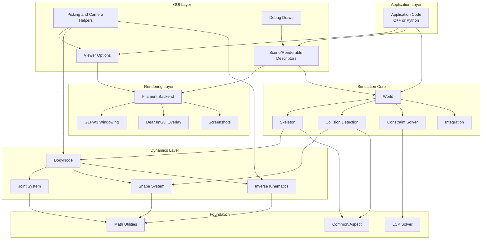
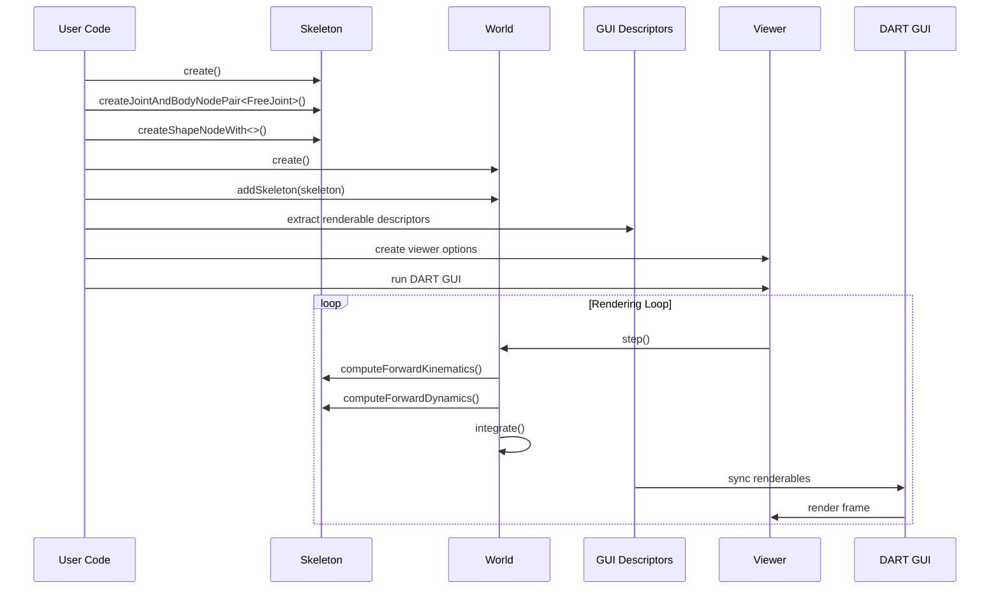
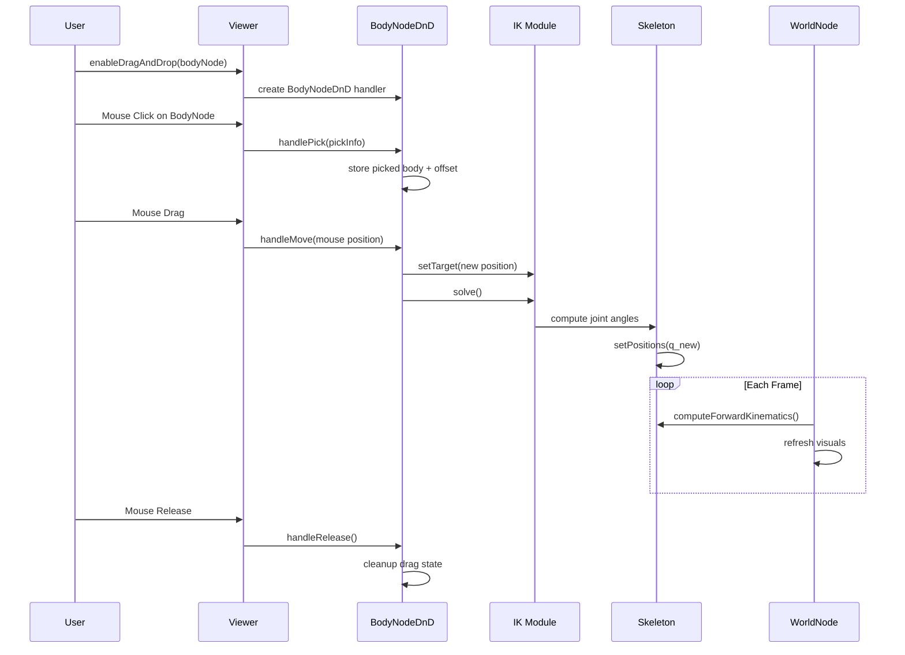
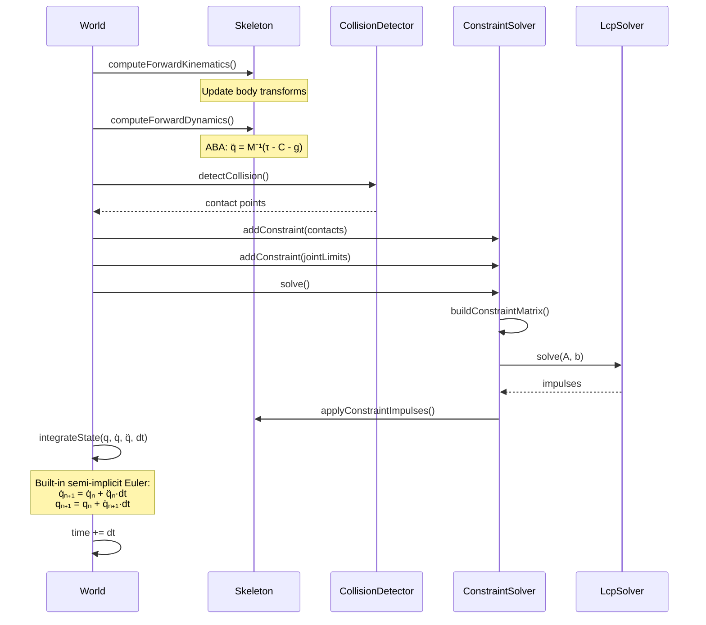
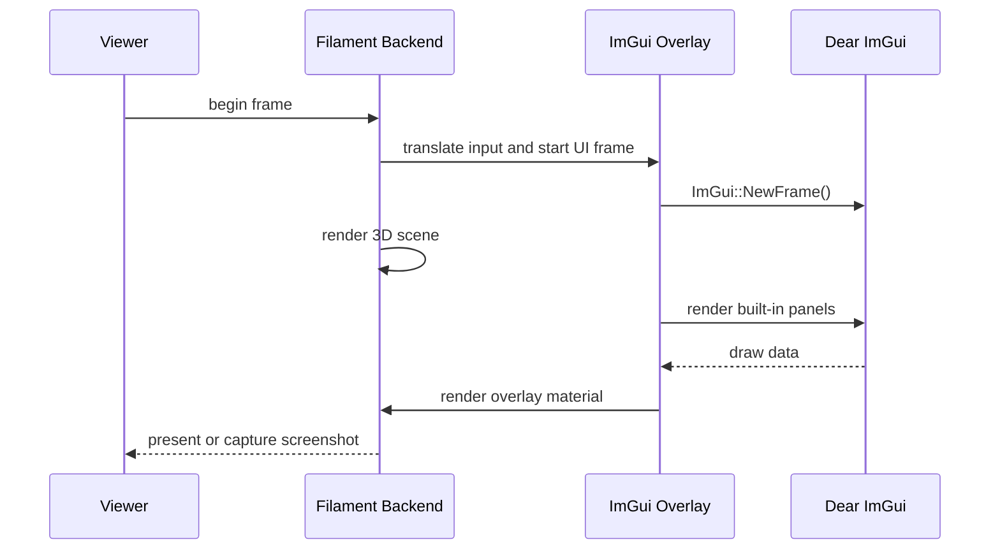
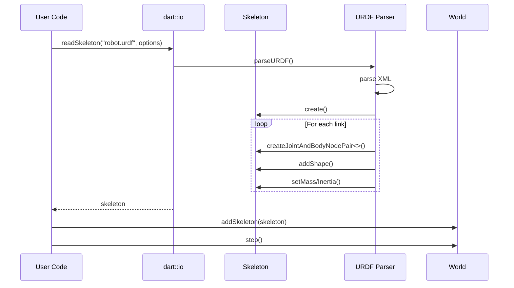
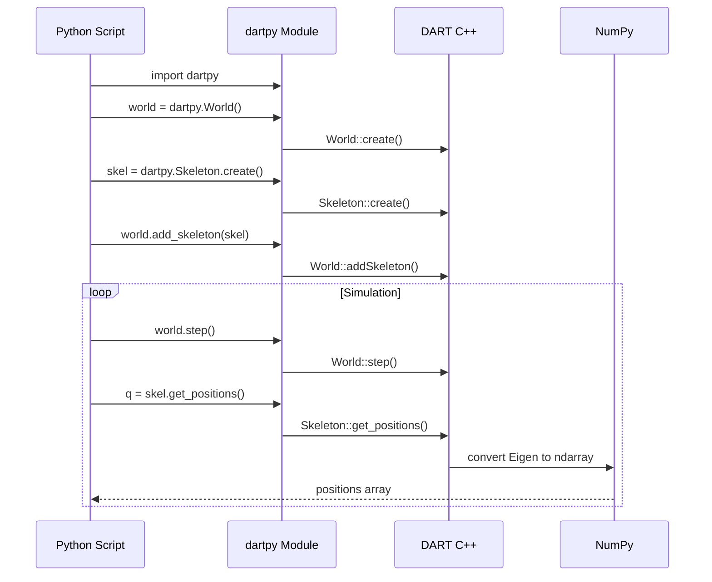

# DART Developer Onboarding Guide

## Start here next time

- Building DART? → [building.md](building.md)
- Running tests? → [testing.md](testing.md)
- Contributing code? → [contributing.md](contributing.md) + [code-style.md](code-style.md)
- Updating release notes? → [changelog.md](changelog.md)
- Understanding core architecture? → [architecture.md](architecture.md)
- Gazebo integration? → [build-system.md](build-system.md#gazebo-integration-feature)
- Key command: `pixi run test-all` (lint + build + all default-environment
  tests); on Linux CUDA hosts also run `pixi run -e cuda test-all`

## Documentation Principles

**Onboarding docs should**:

- ✅ Explain **design decisions** and **why** (not just what)
- ✅ Point to **code as source of truth** (CMakeLists.txt, pixi.toml, source files)
- ✅ Focus on **current state**, not history
- ❌ Avoid hardcoded lists (dependencies, file lists, versions) that become outdated
- ❌ Avoid autogenerated footer metadata (e.g., Generated / Project Version / Maintainer); CI enforces this via `pixi run check-lint`
- ❌ Avoid repeating what's obvious from reading the code

**When information changes frequently** → Point to authoritative source
**When explaining architecture** → Focus on relationships and design decisions

## 1. Overview

**DART** (Dynamic Animation and Robotics Toolkit) is a research-focused C++23
physics engine for robotics, animation, and machine learning. It exposes
transparent kinematics, dynamics, collision, constraint-solving, model-loading,
and Python-binding foundations so researchers can build on DART rather than
treating the simulator as a black box. The **dart_gui** component provides
Filament-backed 3D visualization with GLFW3 windowing and Dear ImGui overlays.

### Release & Branch Strategy

- `main`: active development targeting DART 7 (Python-first API).
- Active DART 6 LTS `release-6.*` branch: maintenance branch for DART 6
  (critical fixes only; currently `release-6.20` in this checkout).

See [release-roadmap.md](release-roadmap.md) for the detailed roadmap, compatibility, and deprecation policy.

### Documentation Principles

**This documentation prioritizes the codebase as the source of truth:**

- Minimal code snippets (prefer links to actual source)
- Avoid details that can become outdated or out-of-sync
- Focus on concepts, patterns, and architecture
- Direct readers to the code for specifics

### Design Principles

**Prefer simplicity over premature generalization:**

- Start with the simplest solution that solves the current problem
- Only add abstraction, hierarchy, or scalability when actually needed
- Resist the urge to design for hypothetical future requirements
- Refactor to add complexity when pain points emerge, not before
- Example: `helpers/common_helpers.hpp` not `helpers/common/test_helpers.hpp` - flat structure is simpler until we have enough helpers to warrant deeper nesting

### Documentation Structure

This onboarding guide is organized into several focused documents:

- **[README.md](README.md)** (this file) - Architecture overview and common workflows
- **[building.md](building.md)** - Step-by-step build instructions for all platforms
- **[contributing.md](contributing.md)** - Comprehensive contribution workflow and guidelines
- **[changelog.md](changelog.md)** - Human-readable changelog and release-note entry rules
- **[code-style.md](code-style.md)** - Code style conventions for C++, Python, and CMake
- **[testing.md](testing.md)** - Test suite organization, unit vs integration tests, running tests
- **[ci-cd.md](ci-cd.md)** - CI/CD workflows, caching strategies, and performance optimization
- **[release-roadmap.md](release-roadmap.md)** - Release/branch strategy and deprecation policy
- **[api-boundaries.md](api-boundaries.md)** - Public vs internal API policy, Python exposure, and symbol visibility
- On-demand public-header and dartpy boundary inventory report via `pixi run report-api-boundary-inventory` (generated to an untracked build path, not committed)
- **[architecture.md](architecture.md)** - Deep dive into DART's simulation core
- **[dynamics.md](dynamics.md)** - Articulated body system and kinematics
- **[constraints.md](constraints.md)** - Constraint resolution and collision response

### Theory References

- **[../background/dynamics/](../background/dynamics/)** - Mathematical foundations (Lagrangian dynamics, equations of motion)
- **[../background/lcp/](../background/lcp/)** - LCP solver theory (contact handling, constraint solving)
- **[gui-rendering.md](gui-rendering.md)** - DART GUI rendering details
- **[python-bindings.md](python-bindings.md)** - nanobind bindings architecture
- **[api-documentation.md](api-documentation.md)** - Publishing strategy for RTD and GitHub Pages API docs
- **[build-system.md](build-system.md)** - CMake internals and dependency analysis
- **[io-parsing.md](io-parsing.md)** - Unified model loading API (`dart::io`)
- **[profiling.md](profiling.md)** - Text-first profiling of the DART 7 World (per-stage step profile + built-in scope profiler)

### Feature Workflows

- **Gazebo / gz-physics integration**: See [build-system.md](build-system.md#gazebo-integration-feature).

### AI Workflow Commands

Repeatable AI workflows live in `.claude/commands/` and are synced to
OpenCode and Codex. Use `/dart-*` in Claude Code/OpenCode and `$dart-*` in
Codex. See [ai-tools.md](ai-tools.md) for compatibility details and
[release-management.md](release-management.md) for release-specific workflows.

### Purpose and Problem Solved

DART addresses the need for:

- **High-fidelity physics simulation** for articulated rigid and soft body systems
- **Efficient algorithms** - O(n) complexity for forward/inverse dynamics using Featherstone algorithms
- **Interactive 3D visualization** for robotics research and development
- **Python integration** for rapid prototyping and machine learning workflows
- **Research-grade tooling** maintained by the DART development contributors

### Key Features

- **Advanced Dynamics**: Articulated body simulation with 10+ joint types, contact resolution, constraint solving
- **Multiple Collision Backends**: FCL (default), Bullet, DART native, ODE
- **3D Visualization**: Filament-backed rendering with shadows, materials, screenshots, and real-time updates
- **Interactive Manipulation**: DART-owned picking, camera, and frame manipulation concepts
- **ImGui Integration**: Private Dear ImGui overlays for controls and diagnostics
- **Python Bindings**: Complete API coverage via nanobind with NumPy integration
- **Optimization Helpers**: Core repo ships gradient-descent + IK primitives; the heavy-duty solver suite (IPOPT, NLopt, pagmo, SNOPT) now lives in [dart-optimization](https://github.com/dartsim/dart-optimization)
- **File Format Support**: URDF, SDF, and MJCF for robot model loading
- **Cross-Platform**: Linux, macOS (Intel/ARM), Windows

> Related projects: motion-planning helpers now reside in [dart-planning](https://github.com/dartsim/dart-planning) and the advanced optimizer suite lives in [dart-optimization](https://github.com/dartsim/dart-optimization). This repository focuses on the simulation core plus lightweight gradient-descent utilities.

### Technologies Used

| Category                | Technology         | Purpose                   |
| ----------------------- | ------------------ | ------------------------- |
| **Core Language**       | C++23              | Main implementation       |
| **Build System**        | CMake 4.2.3+       | Cross-platform builds     |
| **Python Bindings**     | nanobind 2.9.x     | Python API                |
| **Linear Algebra**      | Eigen 3.4.0+       | Math operations           |
| **Collision Detection** | FCL 0.7.0+         | Primary collision backend |
| **3D Rendering**        | Filament 1.71.3    | Visualization             |
| **Windowing/UI**        | GLFW3 + Dear ImGui | Windowing and overlays    |
| **Model Loading**       | assimp 5.4.3+      | 3D asset import           |
| **Environment**         | pixi/conda-forge   | Dependency management     |
| **Graphics API**        | Filament backends  | Rendering backend         |

---

### Quickstart (Decision Tree)

- Want to build, test, or format DART? Start with [building.md](building.md), [testing.md](testing.md), and [contributing.md](contributing.md).
- Working on Gazebo / gz-physics compatibility? Jump to [build-system.md](build-system.md#gazebo-integration-feature).
- Working on Python examples or the dartpy example runner? Start with `python/examples/README.md` and `pixi.toml`.
- Need to understand CI workflows or monitor runs? See [ci-cd.md](ci-cd.md).

<details>
<summary>Deep dive (optional): GUI architecture, data flow, and patterns</summary>

## 2. High-Level Architecture Diagram


```mermaid
graph TB
    subgraph "Application Layer"
        APP[Application Code<br/>C++ or Python]
    end

    subgraph "GUI Layer"
        VIEWER[Viewer Options]
        DESCRIPTORS[Scene/Renderable Descriptors]
        INTERACTION[Picking and Camera Helpers]
        DEBUG[Debug Draws]
    end

    subgraph "Rendering Layer"
        FILAMENT[Filament Backend]
        GLFW[GLFW3 Windowing]
        IMGUI[Dear ImGui Overlay]
        SCREENSHOT[Screenshots]
    end

    subgraph "Simulation Core"
        WORLD[World]
        SKELETON[Skeleton]
        COLLISION[Collision Detection]
        CONSTRAINT[Constraint Solver]
        INTEGRATION[Integration]
    end

    subgraph "Dynamics Layer"
        BODYNODE[BodyNode]
        JOINT[Joint System]
        SHAPES[Shape System]
        IK[Inverse Kinematics]
    end

    subgraph "Foundation"
        MATH[Math Utilities]
        COMMON[Common/Aspect]
        LCP[LCP Solver]
    end

    APP --> VIEWER
    APP --> DESCRIPTORS
    APP --> WORLD

    VIEWER --> FILAMENT
    DESCRIPTORS --> FILAMENT
    INTERACTION --> VIEWER
    DEBUG --> DESCRIPTORS

    FILAMENT --> GLFW
    FILAMENT --> IMGUI
    FILAMENT --> SCREENSHOT
    DESCRIPTORS --> WORLD
    INTERACTION --> BODYNODE
    INTERACTION --> IK

    WORLD --> SKELETON
    WORLD --> COLLISION
    WORLD --> CONSTRAINT
    WORLD --> INTEGRATION

    SKELETON --> BODYNODE
    BODYNODE --> JOINT
    BODYNODE --> SHAPES
    BODYNODE --> IK

    COLLISION --> SHAPES
    CONSTRAINT --> LCP

    JOINT --> MATH
    SHAPES --> MATH
    IK --> MATH
    COLLISION --> COMMON
    SKELETON --> COMMON

    click VIEWER "dart/gui/viewer.hpp" "Open viewer descriptors"
    click DESCRIPTORS "dart/gui/renderable.hpp" "Open renderable descriptors"
    click INTERACTION "dart/gui/interaction.hpp" "Open interaction helpers"
    click WORLD "dart/simulation/World.hpp" "Open World"
    click SKELETON "dart/dynamics/Skeleton.hpp" "Open Skeleton"
    click BODYNODE "dart/dynamics/BodyNode.hpp" "Open BodyNode"
    click JOINT "dart/dynamics/Joint.hpp" "Open Joint"
    click COLLISION "dart/collision/CollisionDetector.hpp" "Open CollisionDetector"
    click CONSTRAINT "dart/constraint/ConstraintSolver.hpp" "Open ConstraintSolver"
```

### Component Explanations

**Application Layer:**

- Entry point for user code (examples, tutorials, custom applications)
- Can be written in C++ or Python (via dartpy bindings)

**GUI Layer:**

- **Viewer descriptors**: Backend-hidden viewer options, lifecycle state, screenshots, and run control
- **Scene descriptors**: DART-owned renderable, material, transform, and debug-draw descriptions
- **Interaction helpers**: Picking, camera, frame translation, axis/plane drag, and directional nudge helpers
- **Filament backend**: Private renderer, resource, input, screenshot, and overlay implementation

**Rendering Layer:**

- **Filament**: Maintained built-in renderer
- **Shape extraction**: Converts DART shapes and visual aspects to backend-hidden renderable descriptors
- **Materials and Textures**: PBR-oriented materials, image loading, transparency, and mesh support
- **Debug Rendering**: Lines, overlays, selection, and diagnostics

**Simulation Core:**

- **World**: Top-level simulation container with time-stepping
- **Skeleton**: Articulated body system (robot/character)
- **Collision Detection**: Multi-backend support (FCL, Bullet, ODE)
- **Constraint Solver**: LCP-based constraint resolution
- **Integration**: Built-in semi-implicit Euler timestepper

**Dynamics Layer:**

- **BodyNode**: Individual rigid body with mass, inertia, shapes
- **Joint System**: 10+ joint types (revolute, prismatic, free, ball, etc.)
- **Shape System**: Collision/visual geometry (box, sphere, mesh, etc.)
- **Inverse Kinematics**: IK solvers for end-effector control

**Foundation:**

- **Math Utilities**: Eigen-based linear algebra, transformations, geometry
- **Common/Aspect**: Design patterns (Factory, Observer, Aspect-oriented)
- **LCP Solver**: Lemke's algorithm for constraint solving

---

## 3. Component Breakdown

### Component: GUI Entry Point

**Files**: [`all.hpp`](../../dart/gui/all.hpp) | [`viewer.hpp`](../../dart/gui/viewer.hpp)

**Purpose**: Public GUI headers expose DART-owned scene, camera, interaction,
debug, and viewer lifecycle concepts. The Filament, GLFW3, and Dear ImGui
implementation details live in private backend sources.

**Key Elements**:

- `RunOptions` - Window/headless frame, screenshot, and run-loop options
- `ViewerLifecycleState` - Backend-hidden lifecycle state for consumers
- `GeometryDescriptor` and `RenderableDescriptor` - Shape/material rendering inputs
- `OrbitCamera` and `OrbitCameraController` - Camera state and manipulation helpers
- `PickRay` and `PickHit` - Picking data without renderer event types

**Depends On**:

- **Internal**: private Filament backend sources
- **External**: Filament, GLFW3, Dear ImGui, PNG, JPEG

---

### Component: GUI Descriptors And Tools

**Files**: [`geometry.hpp`](../../dart/gui/geometry.hpp),
[`renderable.hpp`](../../dart/gui/renderable.hpp),
[`interaction.hpp`](../../dart/gui/interaction.hpp),
[`debug.hpp`](../../dart/gui/debug.hpp)

**Purpose**: Backend-hidden C++ and Python GUI contracts. These headers keep
simulation visualization, picking, camera control, screenshots, and debug
drawing expressed as DART values instead of renderer types.

**Key Elements**:

- Geometry and material descriptors for primitive, mesh, point-cloud,
  heightmap, voxel-grid, and debug line rendering
- Renderable update planning for efficient scene synchronization
- Picking rays, hit records, hit normals, and drag helpers
- Orbit camera state, projection helpers, and directional nudges
- Run options, screenshot configuration, and viewer lifecycle state

**Depends On**:

- **Internal**: DART shapes, frames, worlds, Eigen math, and private Filament
  backend code
- **External**: No renderer or windowing types in public headers

---

### Component: World (Simulation Core)

**File**: [`World.hpp`](dart/simulation/World.hpp) | [`World.cpp`](dart/simulation/World.cpp)

**Purpose**: Top-level simulation container that manages skeletons, simple frames, time-stepping, and coordinates collision detection and constraint solving.

**Key Elements**:

- [`World::step()`](dart/simulation/World.cpp#L356) - Main simulation loop
- [`World::addSkeleton()`](dart/simulation/World.cpp#L196) - Register articulated bodies
- [`World::addSimpleFrame()`](dart/simulation/World.cpp#L241) - Register non-simulated frames
- [`World::setGravity()`](dart/simulation/World.cpp#L489) - Configure gravity vector
- [`World::setTimeStep()`](dart/simulation/World.cpp#L505) - Set integration time step
- Recording support for playback and analysis

**Depends On**:

- **Internal**: Skeleton, SimpleFrame, CollisionDetector, ConstraintSolver (handles time integration internally)
- **External**: Eigen for math operations

---

### Component: Skeleton (Articulated Body System)

**File**: [`Skeleton.hpp`](dart/dynamics/Skeleton.hpp) | [`Skeleton.cpp`](dart/dynamics/Skeleton.cpp)

**Purpose**: Represents articulated rigid body systems (robots, characters) as a tree of BodyNodes connected by Joints. Manages kinematics, dynamics, and state.

**Key Elements**:

- [`Skeleton::create()`](dart/dynamics/Skeleton.cpp#L148) - Factory for creating skeletons
- [`Skeleton::createJointAndBodyNodePair<>()`](dart/dynamics/Skeleton.cpp#L521) - Add body to tree
- [`Skeleton::getMassMatrix()`](dart/dynamics/Skeleton.cpp#L1567) - Compute mass matrix (O(n²))
- [`Skeleton::getCoriolisAndGravityForces()`](dart/dynamics/Skeleton.cpp#L1624) - Compute C(q,q̇) + g(q) (O(n))
- Configuration space: generalized positions (q) and velocities (q̇)
- Support for kinematic trees and closed-loop structures

**Depends On**:

- **Internal**: BodyNode, Joint, IK module, algorithms (ABA, RNEA, CRBA)
- **External**: Eigen for linear algebra

---

### Component: BodyNode (Rigid Body)

**File**: [`BodyNode.hpp`](dart/dynamics/BodyNode.hpp) | [`BodyNode.cpp`](dart/dynamics/BodyNode.cpp)

**Purpose**: Individual rigid body in an articulated system. Manages mass properties, inertia, shapes (collision/visual), and local transformations.

**Key Elements**:

- [`BodyNode::createShapeNodeWith<>()`](dart/dynamics/BodyNode.cpp#L357) - Add shape with aspects
- [`BodyNode::setMass()`](dart/dynamics/BodyNode.cpp#L545) - Configure mass
- [`BodyNode::setInertia()`](dart/dynamics/BodyNode.cpp#L580) - Configure inertia tensor
- [`BodyNode::getWorldTransform()`](dart/dynamics/BodyNode.cpp#L755) - Get global pose
- [`BodyNode::getJacobian()`](dart/dynamics/BodyNode.cpp#L1143) - Compute Jacobian

**Depends On**:

- **Internal**: Joint (parent), Shape, Inertia, Aspect system
- **External**: Eigen for transformations

---

### Component: Joint System

**File**: [`Joint.hpp`](dart/dynamics/Joint.hpp) and specialized joint files

**Purpose**: Connects BodyNodes and defines their relative motion constraints. Provides 10+ joint types for various kinematic configurations.

**Key Joint Types**:

- [`RevoluteJoint`](dart/dynamics/RevoluteJoint.hpp) - 1-DOF rotation (1D)
- [`PrismaticJoint`](dart/dynamics/PrismaticJoint.hpp) - 1-DOF translation (1D)
- [`FreeJoint`](dart/dynamics/FreeJoint.hpp) - 6-DOF unconstrained (6D)
- [`BallJoint`](dart/dynamics/BallJoint.hpp) - 3-DOF rotation (3D)
- [`WeldJoint`](dart/dynamics/WeldJoint.hpp) - 0-DOF fixed (0D)
- [`UniversalJoint`](dart/dynamics/UniversalJoint.hpp) - 2-DOF rotation (2D)
- [`EulerJoint`](dart/dynamics/EulerJoint.hpp) - 3-DOF Euler angles (3D)

**Key Features**:

- Position/velocity limits
- Damping and spring forces
- Coulomb friction
- Servo control

**Depends On**:

- **Internal**: BodyNode, math utilities
- **External**: Eigen for transformations

---

### Component: Collision Detection

**File**: [`CollisionDetector.hpp`](dart/collision/CollisionDetector.hpp) | [`CollisionGroup.hpp`](dart/collision/CollisionGroup.hpp)

**Purpose**: Pluggable collision detection system supporting multiple backends. Detects collisions between shapes and generates contact points.

**Key Backends**:

- [`FCLCollisionDetector`](dart/collision/fcl/FCLCollisionDetector.hpp) - Default, uses FCL library
- [`BulletCollisionDetector`](dart/collision/bullet/BulletCollisionDetector.hpp) - Uses Bullet physics
- [`DARTCollisionDetector`](dart/collision/dart/DARTCollisionDetector.hpp) - Native implementation
- [`OdeCollisionDetector`](dart/collision/ode/OdeCollisionDetector.hpp) - Uses ODE library

**Key Elements**:

- [`CollisionDetector::detectCollision()`](dart/collision/CollisionDetector.cpp#L84) - Run collision detection
- [`CollisionGroup`](dart/collision/CollisionGroup.hpp) - Groups shapes for broad-phase optimization
- [`Contact`](dart/collision/Contact.hpp) - Contact point data structure

**Depends On**:

- **Internal**: Shape, CollisionObject
- **External**: FCL, Bullet, or ODE depending on backend

---

### Component: Constraint Solver

**File**: [`ConstraintSolver.hpp`](dart/constraint/ConstraintSolver.hpp) | [`ConstraintSolver.cpp`](dart/constraint/ConstraintSolver.cpp)

**Purpose**: Resolves constraints (contacts, joint limits, motors) using LCP-based formulation. Computes constraint impulses to satisfy constraint equations.

**Key Elements**:

- [`ConstraintSolver::solve()`](dart/constraint/ConstraintSolver.cpp#L159) - Main constraint solving loop
- [`ConstraintSolver::addConstraint()`](dart/constraint/ConstraintSolver.cpp#L86) - Register constraint
- Constraint types: Contact, JointLimit, Motor, Servo, Mimic (MimicMotor or
  Coupler), custom
- LCP solvers: Dantzig (primary), PGS (fallback)
- Skeleton grouping for independent constraint solving

**Depends On**:

- **Internal**: Constraint classes, math::LcpSolver, Skeleton
- **External**: Eigen for matrix operations

---

### Component: Python Bindings (dartpy)

**Directory**: [`python/`](python/)

**Purpose**: Complete Python API for DART using nanobind. Enables rapid prototyping, machine learning integration, and scripting.

**Key Modules**:

- `dartpy` (top-level) - Core classes/functions (math, dynamics, collision, simulation, constraint, optimizer) exposed in snake_case
- `dartpy.io` - File parsers (URDF, SDF, MJCF) [alias for legacy `utils`]
- `dartpy.gui` - Filament-backed GUI descriptors and helpers
- Legacy `dartpy`/`math`/`dynamics`/`collision`/`simulation`/`constraint`/`optimizer`/`utils` remain importable while DART 7 clean-break gates are being closed, but emit `DeprecationWarning` and should not be part of the DART 7 public contract.

**Key Files**:

- [`pyproject.toml`](pyproject.toml) - Python package configuration
- [`python/dartpy/CMakeLists.txt`](python/dartpy/CMakeLists.txt) - nanobind build definitions
- [`python/dartpy/`](python/dartpy/) - Python bindings source
- Type stubs (`.pyi` files) for IDE support

**Depends On**:

- **Internal**: All DART C++ modules
- **External**: nanobind, NumPy

---

## 4. Data Flow & Call Flow Examples

### Example Flow 1: Creating and Visualizing a Simple Simulation

**Description**: User creates a falling box simulation, converts the world into
GUI descriptors, and runs the Filament-backed viewer loop.

**Sequence Diagram**:


```mermaid
sequenceDiagram
    participant User as User Code
    participant Skeleton as Skeleton
    participant World as World
    participant Descriptors as GUI Descriptors
    participant Viewer as Viewer
    participant GUI as DART GUI

    User->>Skeleton: create()
    User->>Skeleton: createJointAndBodyNodePair<FreeJoint>()
    User->>Skeleton: createShapeNodeWith<>()
    User->>World: create()
    User->>World: addSkeleton(skeleton)
    User->>Descriptors: extract renderable descriptors
    User->>Viewer: create viewer options
    User->>Viewer: run DART GUI

    loop Rendering Loop
        Viewer->>World: step()
        World->>Skeleton: computeForwardKinematics()
        World->>Skeleton: computeForwardDynamics()
        World->>World: integrate()
        Descriptors->>GUI: sync renderables
        GUI->>Viewer: render frame
    end
```

**Key Files**:

- Example: [`examples/demos/scenes/rigid_body.cpp`](../../examples/demos/scenes/rigid_body.cpp)
- [`World::step()`](dart/simulation/World.cpp#L356)
- [`RunOptions`](../../dart/gui/viewer.hpp)
- [`RenderableDescriptor`](../../dart/gui/renderable.hpp)

---

### Example Flow 2: Interactive Drag-and-Drop with IK

**Description**: User enables drag-and-drop for a robot body node, clicks and drags it, triggering inverse kinematics to reposition the robot while maintaining constraints.

**Sequence Diagram**:


```mermaid
sequenceDiagram
    participant User as User
    participant Viewer as Viewer
    participant DnD as BodyNodeDnD
    participant IK as IK Module
    participant Skeleton as Skeleton
    participant WorldNode as WorldNode

    User->>Viewer: enableDragAndDrop(bodyNode)
    Viewer->>DnD: create BodyNodeDnD handler

    User->>Viewer: Mouse Click on BodyNode
    Viewer->>DnD: handlePick(pickInfo)
    DnD->>DnD: store picked body + offset

    User->>Viewer: Mouse Drag
    Viewer->>DnD: handleMove(mouse position)
    DnD->>IK: setTarget(new position)
    DnD->>IK: solve()
    IK->>Skeleton: compute joint angles
    Skeleton->>Skeleton: setPositions(q_new)

    loop Each Frame
        WorldNode->>Skeleton: computeForwardKinematics()
        WorldNode->>WorldNode: refresh visuals
    end

    User->>Viewer: Mouse Release
    Viewer->>DnD: handleRelease()
    DnD->>DnD: cleanup drag state
```

**Key Files**:

- Example: [`examples/atlas_puppet/main.cpp`](../../examples/atlas_puppet/main.cpp)
- [`pickNearestRenderable()`](dart/gui/interaction.hpp#L60)
- [`IK::solve()`](dart/dynamics/IK.cpp#L142)
- [`translateFrameRenderable()`](dart/gui/interaction.hpp#L90)

---

### Example Flow 3: World Simulation Step (Physics Pipeline)

**Description**: Internal process of a single World::step() call, showing collision detection, constraint solving, and integration.

**Sequence Diagram**:


```mermaid
sequenceDiagram
    participant World as World
    participant Skeleton as Skeleton
    participant CollisionDet as CollisionDetector
    participant ConstraintS as ConstraintSolver
    participant LCP as LcpSolver

    World->>Skeleton: computeForwardKinematics()
    Note over Skeleton: Update body transforms

    World->>Skeleton: computeForwardDynamics()
    Note over Skeleton: ABA: q̈ = M⁻¹(τ - C - g)

    World->>CollisionDet: detectCollision()
    CollisionDet-->>World: contact points

    World->>ConstraintS: addConstraint(contacts)
    World->>ConstraintS: addConstraint(jointLimits)

    World->>ConstraintS: solve()
    ConstraintS->>ConstraintS: buildConstraintMatrix()
    ConstraintS->>LCP: solve(A, b)
    LCP-->>ConstraintS: impulses
    ConstraintS->>Skeleton: applyConstraintImpulses()

    World->>World: integrateState(q, q̇, q̈, dt)
    Note over World: Built-in semi-implicit Euler:<br/>q̇ₙ₊₁ = q̇ₙ + q̈ₙ·dt<br/>qₙ₊₁ = qₙ + q̇ₙ₊₁·dt

    World->>World: time += dt
```

**Key Files**:

- [`World::step()`](dart/simulation/World.cpp#L356)
- [`Skeleton::computeForwardDynamics()`](dart/dynamics/Skeleton.cpp#L2154)
- [`ConstraintSolver::solve()`](dart/constraint/ConstraintSolver.cpp#L159)

---

### Example Flow 4: Filament Overlay Rendering

**Description**: How built-in GUI overlays are integrated into the private
Filament frame lifecycle.

**Sequence Diagram**:


```mermaid
sequenceDiagram
    participant Viewer as Viewer
    participant Backend as Filament Backend
    participant Overlay as ImGui Overlay
    participant ImGui as Dear ImGui

    Viewer->>Backend: begin frame
    Backend->>Overlay: translate input and start UI frame
    Overlay->>ImGui: ImGui::NewFrame()
    Backend->>Backend: render 3D scene
    Overlay->>ImGui: render built-in panels
    ImGui-->>Overlay: draw data
    Overlay->>Backend: render overlay material
    Backend-->>Viewer: present or capture screenshot
```

**Key Files**:

- [`imgui_overlay.cpp`](../../dart/gui/detail/imgui_overlay.cpp)
- [`panel.cpp`](../../dart/gui/detail/panel.cpp)

---

### Example Flow 5: Loading URDF and Creating Simulation

**Description**: Loading a robot model from URDF file and adding it to simulation world.

**Sequence Diagram**:


```mermaid
sequenceDiagram
    participant User as User Code
    participant IO as dart::io
    participant Skeleton as Skeleton
    participant Parser as URDF Parser
    participant World as World

    User->>IO: readSkeleton("robot.urdf", options)
    IO->>Parser: parseURDF()
    Parser->>Parser: parse XML
    Parser->>Skeleton: create()

    loop For each link
        Parser->>Skeleton: createJointAndBodyNodePair<>()
        Parser->>Skeleton: addShape()
        Parser->>Skeleton: setMass/Inertia()
    end

    IO-->>User: skeleton
    User->>World: addSkeleton(skeleton)
    User->>World: step()
```

**Key Files**:

- [`dart::io` unified API](dart/io/Read.hpp)
- Implementation: [`dart/io/Read.cpp`](dart/io/Read.cpp)
- Internal parser: [`UrdfParser`](dart/utils/urdf/urdf_parser.hpp)
- Entry point: [`UrdfParser::parseSkeleton()`](dart/utils/urdf/urdf_parser.cpp)
- Example: [`examples/atlas_puppet/main.cpp`](../../examples/atlas_puppet/main.cpp)
- Notes: URDF `<limit>` on `planar` and `floating` joints is interpreted uniformly across all of their DOFs (with warnings), and planar joints derive their plane from the `<axis>` normal.

---

### Example Flow 6: Python API Usage

**Description**: Using the Python bindings (dartpy) to create and simulate a robot.

**Sequence Diagram**:


```mermaid
sequenceDiagram
    participant Python as Python Script
    participant dartpy as dartpy Module
    participant DART as DART C++
    participant NumPy as NumPy

    Python->>dartpy: import dartpy
    Python->>dartpy: world = dartpy.World()
    dartpy->>DART: World::create()

    Python->>dartpy: skel = dartpy.Skeleton.create()
    dartpy->>DART: Skeleton::create()

    Python->>dartpy: world.add_skeleton(skel)
    dartpy->>DART: World::addSkeleton()

    loop Simulation
        Python->>dartpy: world.step()
        dartpy->>DART: World::step()
        Python->>dartpy: q = skel.get_positions()
        dartpy->>DART: Skeleton::get_positions()
        DART->>NumPy: convert Eigen to ndarray
        NumPy-->>Python: positions array
    end
```

**Key Files**:

- Example: [`python/examples/hello_world/main.py`](../../python/examples/hello_world/main.py)
- [`python/dartpy/`](python/dartpy/) - Bindings implementation
- [`pyproject.toml`](pyproject.toml) - Python package configuration (scikit-build-core)

---

## 5. Data Models (Entities)

### Entity: Skeleton

**File**: [`Skeleton.hpp`](dart/dynamics/Skeleton.hpp)

**Purpose**: Articulated body system representing a robot or character

**Key Fields**:

- `mBodyNodes: std::vector<BodyNode*>` - Tree of rigid bodies
- `mJoints: std::vector<Joint*>` - Joint connections
- `mDofs: std::vector<DegreeOfFreedom*>` - Generalized coordinates
- `q: Eigen::VectorXd` - Generalized positions
- `dq: Eigen::VectorXd` - Generalized velocities
- `ddq: Eigen::VectorXd` - Generalized accelerations

**Relations**:

- Contains: BodyNode tree, Joints, DOFs
- Used by: World, IK module, ConstraintSolver

**Notes**:

- Tree structure with efficient O(n) algorithms (ABA, RNEA)
- Supports closed-loop structures via constraints
- Configuration space uses Lie group representations for joints

---

### Entity: BodyNode

**File**: [`BodyNode.hpp`](dart/dynamics/BodyNode.hpp)

**Purpose**: Individual rigid body in an articulated system

**Key Fields**:

- `mMass: double` - Body mass
- `mInertia: Inertia` - Inertia tensor and COM offset
- `mParentJoint: Joint*` - Incoming joint from parent
- `mChildBodyNodes: std::vector<BodyNode*>` - Children in tree
- `mShapeNodes: std::vector<ShapeNode*>` - Collision/visual shapes
- `mT: Eigen::Isometry3d` - World transformation

**Relations**:

- Parent: Joint (incoming)
- Children: BodyNode (outgoing)
- Contains: ShapeNode collection
- Part of: Skeleton

**Notes**:

- Mass properties required for dynamics
- Multiple shapes per body supported
- Transformations updated via forward kinematics

---

### Entity: Joint

**File**: [`Joint.hpp`](dart/dynamics/Joint.hpp)

**Purpose**: Kinematic constraint connecting two BodyNodes

**Key Fields**:

- `mNumDofs: size_t` - Degrees of freedom (0-6)
- `mPositions: Eigen::VectorXd` - Joint positions (q)
- `mVelocities: Eigen::VectorXd` - Joint velocities (q̇)
- `mAccelerations: Eigen::VectorXd` - Joint accelerations (q̈)
- `mPositionLowerLimits: Eigen::VectorXd` - Lower position bounds
- `mPositionUpperLimits: Eigen::VectorXd` - Upper position bounds
- `mDampingCoefficients: Eigen::VectorXd` - Damping forces
- `mSpringStiffnesses: Eigen::VectorXd` - Spring forces

**Relations**:

- Connects: Parent BodyNode → Child BodyNode
- Owned by: Skeleton

**Notes**:

- 10+ specialized joint types (Revolute, Prismatic, Free, etc.)
- Supports position/velocity limits, damping, springs
- Provides relative transformation between bodies

---

### Entity: Shape

**File**: [`Shape.hpp`](dart/dynamics/Shape.hpp)

**Purpose**: Geometric representation for collision detection and visualization

**Key Shape Types**:

- `BoxShape` - Rectangular box
- `SphereShape` - Sphere
- `CylinderShape` - Cylinder
- `CapsuleShape` - Capsule (cylinder + hemispheres)
- `MeshShape` - Arbitrary triangle mesh
- `SoftMeshShape` - Deformable mesh
- `PointCloudShape` - Point cloud
- `VoxelGridShape` - Voxel grid

**Key Fields**:

- `mVolume: double` - Shape volume
- `mBoundingBox: BoundingBox` - Axis-aligned bounding box

**Relations**:

- Owned by: ShapeNode
- Used by: CollisionDetector, Renderer

**Notes**:

- Shapes can have multiple aspects (Visual, Collision, Dynamics)
- Inertia computed from shape geometry
- Material properties for rendering

---

### Entity: World

**File**: [`World.hpp`](dart/simulation/World.hpp)

**Purpose**: Top-level simulation container

**Key Fields**:

- `mSkeletons: std::vector<Skeleton*>` - Articulated bodies
- `mSimpleFrames: std::vector<SimpleFrame*>` - Non-simulated frames
- `mTime: double` - Current simulation time
- `mTimeStep: double` - Integration time step (default: 0.001s)
- `mGravity: Eigen::Vector3d` - Gravity vector (default: [0,0,-9.81])
- `mCollisionDetector: CollisionDetector*` - Collision system
- `mConstraintSolver: ConstraintSolver*` - Constraint system

**Relations**:

- Contains: Skeletons, SimpleFrames
- Uses: CollisionDetector, ConstraintSolver
- Rendered by: WorldNode

**Notes**:

- Manages simulation time and stepping
- Coordinates collision detection and constraint solving
- Supports recording for playback

---

### Entity: Contact

**File**: [`Contact.hpp`](dart/collision/Contact.hpp)

**Purpose**: Contact point data from collision detection

**Key Fields**:

- `point: Eigen::Vector3d` - Contact point in world coordinates
- `normal: Eigen::Vector3d` - Contact normal (from object A to B)
- `penetrationDepth: double` - Overlap distance
- `collisionObject1: CollisionObject*` - First colliding object
- `collisionObject2: CollisionObject*` - Second colliding object

**Relations**:

- Generated by: CollisionDetector
- Used by: ConstraintSolver (creates contact constraints)

**Notes**:

- Multiple contacts per collision pair
- Normal points from object A to object B
- Penetration depth used for impulse calculation

---

### Entity: Constraint

**File**: [`ConstraintBase.hpp`](dart/constraint/ConstraintBase.hpp)

**Purpose**: Abstract base for constraint types

**Constraint Types**:

- `ContactConstraint` - Contact between bodies
- `JointLimitConstraint` - Joint position/velocity limits
- `ServoMotorConstraint` - Joint servo control
- `MimicMotorConstraint` - Mimic joint behavior
- `CouplerConstraint` - Bilateral mimic coupling (equal-and-opposite impulses)
- Custom constraints

**Key Fields**:

- `mDim: size_t` - Constraint dimensionality
- `mActive: bool` - Whether constraint is active

**Relations**:

- Managed by: ConstraintSolver
- Acts on: Skeleton DOFs

**Notes**:

- Formulated as LCP (Linear Complementarity Problem)
- Computes impulses to satisfy constraint equations

---

### Entity: Frame

**File**: [`Frame.hpp`](dart/dynamics/Frame.hpp)

**Purpose**: Coordinate frame in the simulation world

**Types**:

- `BodyNode` - Frame attached to rigid body
- `SimpleFrame` - User-defined static or movable frame
- `InteractiveFrame` - Frame with 3D manipulation handles

**Key Fields**:

- `mParentFrame: Frame*` - Parent in frame hierarchy
- `mRelativeTransform: Eigen::Isometry3d` - Transform relative to parent
- `mWorldTransform: Eigen::Isometry3d` - Cached world transform

**Relations**:

- Hierarchy: Parent-child frame tree
- Can contain: ShapeNodes for visualization

**Notes**:

- All entities inherit from Frame
- World coordinate frame is root of hierarchy
- Transformations propagate down the tree

---

## 6. Build and Development Guide

This section is intentionally brief and delegates to the focused onboarding docs:

- Build / install / pixi tasks: [building.md](building.md)
- Contribution workflow + formatting: [contributing.md](contributing.md)
- Test suite structure + running tests: [testing.md](testing.md)
- Gazebo / gz-physics integration: [build-system.md](build-system.md#gazebo-integration-feature)

Suggested (Unverified):

- `pixi run test-all` (recommended by the PR template)
- `pixi run -e cuda test-all` when a Linux host has a visible NVIDIA CUDA
  runtime

---

## 7. Common Workflows and Patterns

### Pattern 1: Creating a Basic Simulation

```cpp
// Create skeletons
auto robot = dynamics::Skeleton::create("robot");
// ... add bodies, joints, shapes

// Create world
auto world = simulation::World::create();
world->addSkeleton(robot);
world->setGravity(Eigen::Vector3d(0, 0, -9.81));
world->setTimeStep(0.001);

// Simulation loop
while (running) {
  world->step();
  // Access state: robot->getPositions(), getVelocities()
}
```

### Pattern 2: Creating Visualization

```cpp
// Extract backend-hidden renderable descriptors from a DART world.
auto renderables = dart::gui::extractRenderables(*world);

// Use the maintained DART GUI app for interactive or headless rendering.
// Repo-local command line:
//   pixi run ex dartsim --scene boxes
//   pixi run ex dartsim --headless --frames 1 --screenshot frame.ppm
```

### Pattern 3: Custom Simulation Hooks

```cpp
dart::gui::ViewerLifecycleState lifecycle;
auto options = dart::gui::RunOptions{};

if (dart::gui::shouldAdvanceSimulation(lifecycle)) {
  auto robot = world->getSkeleton("robot");
  robot->setForces(computeControlTorques());
  world->step();
  dart::gui::markSimulationAdvanced(lifecycle);
}
```

### Pattern 4: Interactive Manipulation

```cpp
auto ray = dart::gui::makePerspectivePickRay(
    camera, mouseX, mouseY, viewportWidth, viewportHeight);
auto hit = dart::gui::pickNearestRenderable(renderables, ray);
if (hit) {
  auto translation = dart::gui::computePlaneDragTranslation(
      previousRay, ray, hit->position, dragPlaneNormal);
  dart::gui::translateFrameRenderable(*world, hit->renderableId, translation);
}
```

### Pattern 5: Loading Robot Models

```cpp
dart::io::ReadOptions options;

// URDF (package:// mapping is optional)
options.addPackageDirectory("my_robot", "/path/to/my_robot");
auto robot = dart::io::readSkeleton("path/to/robot.urdf", options);
world->addSkeleton(robot);

// SDF
auto model = dart::io::readSkeleton("path/to/model.sdf");
```

> **Note:** DART 7 is removing legacy SKEL support instead of redesigning it as
> YAML. Migrate existing SKEL assets to URDF, SDF, or MJCF; use a `release-6.*`
> branch when compatibility with old SKEL assets is required.

### Pattern 6: Debug Draws And Capture

```cpp
dart::gui::DebugDrawOptions debug;
debug.showContactForces = true;
debug.showSupportPolygons = true;

auto lines = dart::gui::extractDebugLines(*world, debug);
dart::gui::writeRgbaPpm("frame.ppm", rgba, width, height);
```

---

## 8. Additional Resources

### Documentation

- **Main Website**: https://docs.dartsim.org/
- **API Documentation**: Built with Doxygen (run `pixi run api-docs-cpp`)
- **Examples**: [`examples/`](../../examples/)

### Community

- **GitHub**: https://github.com/dartsim/dart
- **Maintained by**: the DART development contributors

### Related Analysis Documents

This repository contains additional detailed analysis documents:

- [`architecture.md`](architecture.md) - Core DART architecture deep dive
- [`aspect-system.md`](aspect-system.md) - Aspect/State/Properties design and implementation
- [`gui-rendering.md`](gui-rendering.md) - DART GUI rendering details
- [`python-bindings.md`](python-bindings.md) - Python bindings (dartpy) reference
- [`build-system.md`](build-system.md) - Build system and dependencies
- [`dynamics.md`](dynamics.md) - Dynamics system exploration
- [`constraints.md`](constraints.md) - Constraint solver analysis

### Key Design Patterns Used in DART

- **Factory Pattern**: Skeleton::create(), Joint factories
- **Strategy Pattern**: Pluggable collision backends, integrators, solvers
- **Observer Pattern**: Event handlers, callbacks
- **Composite Pattern**: Frame hierarchy, BodyNode tree
- **Aspect Pattern**: Runtime extensibility for entities
- **Template Method Pattern**: WorldNode customization hooks
- **Singleton Pattern**: Global registries
- **RAII Pattern**: Smart pointers, resource management

---

## Summary

**DART** is a mature, research-focused physics engine and visualization stack
with:

✅ **O(n) efficient dynamics** via Featherstone algorithms
✅ **Interactive 3D visualization** through the Filament + GLFW3 + Dear ImGui GUI
✅ **Multiple collision backends** (FCL, Bullet, ODE)
✅ **Python integration** for ML/research workflows
✅ **Extensive file format support** (URDF, SDF, MJCF)
✅ **Cross-platform** with reproducible builds via pixi

The codebase demonstrates clear layering, design patterns, and extensibility.
New visualization work should keep renderer implementation types private and
build on the Filament-backed DART GUI concepts.

</details>
