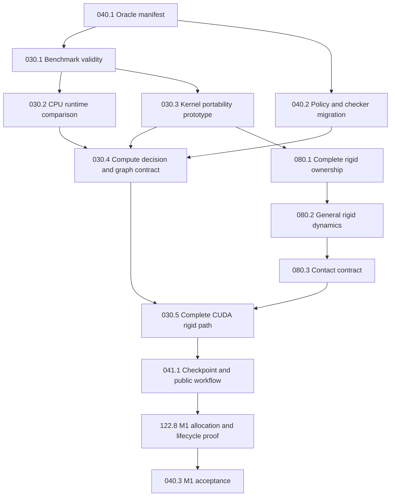

# PLAN-040: DART 7 Readiness Milestones

- Operating state: `PLAN-040` in [dashboard.md](dashboard.md).
- Outcome: qualify a dependable DART 7 research workflow through explicit
  foundation, physics, and release gates; give every remaining gap one owner.
- Current evidence: source audit of parent PR
  [#3479](https://github.com/dartsim/dart/pull/3479), revision
  `afe6c7d5212d6a2fa3a4b56a2d72701ea84b00cd`, on 2026-09-04.
  [Architecture assessment](../design/dart7_architecture_assessment.md) owns
  current findings and source/test references. Inspection is not a test pass.

## Decisions And Boundaries

DART 7 is a new engine with its own architecture and public API, not a
compatibility revision of DART 6. Reuse sound utilities and independent
comparison evidence; do not make DART 6 behavior the definition of correctness.
The maintained DART 6 line retains its separate support/Gazebo obligations.

- Milestones are readiness gates, not dates. A documentation or prototype PR
  cannot complete a physics milestone.
- Every M1 example must execute fully on CPU and CUDA in Float64. CUDA remains
  optional to install; CUDA runtime evidence is mandatory for M1 acceptance.
  CPU fallback, GPU compilation alone, and skipped runtime tests do not pass.
- Prefer simple public workflows and internal contracts with demonstrated
  second uses. Do not require all domains or every research method in M1.
- Evaluate the compute runtime and kernel approach before broad new parallel
  or CUDA implementation. PLAN-030 owns the decision; no library winner has
  been established by DART workload measurements.
- Physical domain, intrinsic dimension, discretization, numerical method,
  coupling, and device/precision are distinct capability axes. The
  [solver architecture](../design/simulation_solver_architecture.md) owns them.
- Numerical thresholds below are proposed fixture inputs until WP-040.1
  accepts the complete oracle manifest. Do not tune tolerances to observed
  errors or label downstream packets executable before that acceptance.

## Milestones And Gaps

Dependencies below are readiness requirements, not a requirement to run every
research lane serially. Within a milestone, prerequisite packets govern work.
Each exit retains the supported shape/material/method/backend envelope and
records missing cells explicitly.

| Milestone                                   | Scope and priority order                                                                                                                                                                                        | Current gap and owners                                                                                                                                                                                                      | Dependencies and exit evidence                                                                                                                                                                                                                                                                                                                                                             |
| ------------------------------------------- | --------------------------------------------------------------------------------------------------------------------------------------------------------------------------------------------------------------- | --------------------------------------------------------------------------------------------------------------------------------------------------------------------------------------------------------------------------- | ------------------------------------------------------------------------------------------------------------------------------------------------------------------------------------------------------------------------------------------------------------------------------------------------------------------------------------------------------------------------------------------ |
| **M1: Trustworthy rigid foundations**       | Compute decision and ownership first; then one dynamic sphere or box with an optional static plane, general rotation, forces/torques, contact, friction, restitution, complete checkpoints, and Python/C++ use. | CPU rigid physics and useful data/GPU seeds exist; complete state ownership, rotational correctness, isotropic friction, full CUDA contact/step execution, and portable continuation are partial. PLAN-030/080/041/042/122. | WP-040.3 accepts the entire named CPU/CUDA Float64 example, restart, lifecycle, allocation, installed-package, and visual evidence matrix.                                                                                                                                                                                                                                                 |
| **M2: Interacting bodies and scaling**      | Dynamic body-body contact; drop 100 bodies onto a plane and into a box, then a triangulated bowl; profile before optimizing collision, islands, solver work, task grouping, and transfers.                      | Native broadphase/contact and larger demos exist, but no qualifying current-build 100-body end-to-end packet was located. Existing runtime graphs do not prove dynamic grouping or cost-based scheduling. PLAN-080/030/122. | M1 plus an accepted many-body manifest. One interacting 100-body world passes physical residual/penetration/settling and restart budgets on CPU and CUDA for plane/box/bowl scenes. Publish p50/p95/p99 step latency, throughput, memory, contact counts, and stage/transfer costs; independent-world batches are separate rows.                                                           |
| **M3: Robotics and reproducible research**  | Qualify articulated dynamics, joints, limits, actuators, rigid-articulated contacts, loading, observations, reset, and checkpoints; compare compatible methods through one scene contract.                      | Articulated paths and some comparisons exist; end-to-end installed research workflows, remaining loader/actuator/diagnostic gaps, and broad method substitution are incomplete. PLAN-080/041/042/012/103 and family owners. | M2 and each admitted family contract. Installed C++/Python pendulum, articulated-chain, and controlled-contact examples pass analytic/reference, control, restart, and unsupported-selection tests. Verify complexity claims by chain-size measurements; record actual method, accuracy, and timing.                                                                                       |
| **M4: First bidirectional multiphysics**    | Fixed-corotational tetrahedral solid plus rigid bodies, initially frictionless; bounded comparison of a shared solve and partitioned coupling.                                                                  | FEM and rigid obstacle interactions exist; they do not establish general two-way coupling. PLAN-081/083/104 and solver intake.                                                                                              | M1 ownership/compute contracts plus accepted solid/coupling design. Independent deformation references, interface momentum/work balance, timestep and coupling-iteration convergence, and complete restart. Accepted/rejected steps, retries and subcycling preserve coherent domain states, clocks and controls and apply each exchange exactly once. Moving obstacles alone do not pass. |
| **M5: Thin structures**                     | Cloth/shells and rods/hair; explicit stretch, bend, twist, thickness, and contact models.                                                                                                                       | Representation tags do not establish working thin-domain World physics. Solver-family intake assigns finite successor initiatives before implementation.                                                                    | Accepted thin-structure design and M4 interaction contracts. Cantilever, oscillation, stretch/bend/twist, self/rigid-contact, and restart tests; distinguish intrinsic dimension, constitutive law, discretization, and backend coverage.                                                                                                                                                  |
| **M6: Selected fluids and granular models** | Choose one fluid formulation and one rigid-fluid interaction; distinguish discrete grains, continuum granular material, reduced aerodynamic forces, and resolved flow.                                          | These are future capability cells, not consequences of having particles or a multi-domain enum. Solver-family intake assigns finite successor initiatives.                                                                  | Accepted formulation/coupling prototypes. Mass conservation, hydrostatics, dam-break reference, buoyancy/interface forces, timestep/resolution convergence, and checkpoint/backend evidence. No universal fluid/granular/aerodynamic coverage claim.                                                                                                                                       |

Single-body and 100-body work are successive milestones: the first isolates
fundamental errors; the second adds contact graphs, capacity, geometry, and
parallel scaling. M1 may be slower on a GPU than a CPU. M2 requires honest
CPU/CUDA matched-accuracy measurements and justified optimization, not an
unsupported universal speedup. Its admitted manifest must include all three
interacting scenes and separate independent-world batch rows on both backends;
a missing backend cell prevents M2 completion.
Reuse the native AABB-tree CPU baseline; compare GPU broadphase alternatives
only against the actual M2 distributions and matched collision coverage.

The recommended **DART 7.0 release candidate** is M1-M3 plus the
[release qualification requirements](../onboarding/release-roadmap.md).
M4-M6 are visible research directions, not automatic release blockers. PLAN-040
ends when that finite release outcome is qualified and remaining directions
have explicit successor owners/dependencies. Do not close their work when
archiving this coordinator, or keep adding unlimited phases to PLAN-040.

## M1 Dependency Map

IDs in the diagram denote `WP-<plan>.<n>` packets. Detailed implementation
contracts live in [PLAN-030](030-compute-scalability-roadmap.md),
[PLAN-080](080-rigid-body-dynamics-solver.md),
[PLAN-041](041-official-simulation-api-promotion.md), and
[PLAN-122](122-simulation-loop-allocation-hardening.md). PLAN-042 retains
public-header/source-layout ownership; PLAN-041's checkpoint packet must
satisfy those boundaries rather than repeat its migration.

## M1 Example And Numerical Contract

The manifest uses public C++ and Python scene construction. It records physical
units, shape dimensions, mass/inertia, initial pose/velocity, input point/frame,
gravity, material combination, timestep/substeps, solver/variant, iteration
policy, precision, duration, independent oracle, and absolute-plus-relative
error budgets. Every row is required on CPU and CUDA, including snapshot
continuations. Distinct examples can share one scene builder.

Proposed fixture defaults: masses 1 and 10 kg; sphere radius 0.25 m; asymmetric
box side lengths 0.5/0.75/1 m; gravity magnitude 9.81 m/s²; four-second runs;
timestep refinement at 1/240, 1/480, and 1/960 s. WP-040.1 fixes forces,
torques, velocities, contact tolerances, and iteration budgets from analytic
and discretization evidence. It also bounds initial penetration, aspect ratios,
motion per step, and the admissible scale/speed range. Discrete collision is
the M1 contract; it does not promise arbitrary high-speed tunneling resistance.

| Example ID | Required scenario                                                                                     | Independent acceptance evidence                                                                                                                                                           |
| ---------- | ----------------------------------------------------------------------------------------------------- | ----------------------------------------------------------------------------------------------------------------------------------------------------------------------------------------- |
| RB-01      | Free fall and constant external force; persistent versus one-shot input                               | Discrete semi-implicit velocity/position oracle and convergence to continuous motion; input lifecycle and linear momentum.                                                                |
| RB-02      | Principal-axis torque and centered/offset force in declared frames                                    | Torque/inertia oracle, force-to-torque moment arm, orientation error, and quaternion normalization.                                                                                       |
| RB-03      | Torque-free asymmetric box tumbling                                                                   | Angular-momentum conservation, bounded energy error with timestep refinement, and an independently converged rotational reference. Constant angular velocity is not the general solution. |
| RB-04      | Sphere-plane impact and repeated frictionless elastic bounce                                          | Pre/post contact-stage restitution, no tangential impulse, same-height energy comparisons, and flight/impact/correction energy accounted separately.                                      |
| RB-05      | Box face/edge/corner and oblique impacts; changing manifolds                                          | Contact geometry/normals, deterministic ordering, impulse and angular-response reference, bounded penetration, and no spurious centered-impact spin.                                      |
| RB-06      | Flat, non-tipping box sliding at 0/45/90 degrees and zero-friction motion                             | Coulomb deceleration, stopping time/distance, non-increasing dissipative energy, no reversal, and invariance under tangential-basis rotation.                                             |
| RB-07      | Flat, non-tipping box under tangential load below/above static-friction threshold and resting support | Stick/slide transition, settled velocity/height, penetration budget, and time-averaged normal reaction balancing weight. Existing ±20% force coverage is not the target accuracy.         |

For multipoint box impacts, compare aggregate impulse/angular response and
contact/friction residuals; individual point impulses need not be unique.
RB-06/07 loads must preserve the declared flat support mode. A free sphere
that transitions to rolling is not governed by the same stopping-distance oracle.

M1 qualifies semi-implicit translation, manifold-aware general rotation, and
hard unilateral sequential-impulse contact. Friction uses a circular tangential
Coulomb projection with one coefficient initially, geometric-mean pair
combination, and maximum pair restitution. Restitution uses the pre-solve
approaching velocity once; its low-speed cutoff is disabled in elastic
diagnostics. Separate positional stabilization from energy in the physical
system. Retain named legacy/pyramid variants only as explicit comparison
configurations, not as an invisible change to the selected method.

For constant acceleration, check the exact discrete result
`v(T) = v0 + a T`, `x(T) = x0 + v0 T + a (T² + T h) / 2`.
Under gravity alone, semi-implicit Euler has energy bias
`-m g² T h / 2`. Restitution one is an impact law, not exact finite-step total
energy conservation. Bound and refine the separate errors; do not demand
energy conservation for friction or inelastic impacts. Use nonzero reference
length, speed, and energy scales rather than relative error divided by zero.

## Checkpoint, Lifecycle, And Usability Acceptance

- Checkpoints are self-contained for the supported M1 scene: model/geometry,
  schema and model/configuration fingerprints, resolved variant and precision,
  timestep policy, complete pose/velocity, clock, controls, and every
  result-affecting history field. List recomputable workspace explicitly.
- Test CPU→CPU, CUDA→CUDA, CPU→CUDA, and CUDA→CPU in fresh processes, captured
  during flight, impact/contact, sliding, and rest. Exact replay applies only
  to pinned deterministic same-backend configurations; cross-device comparison
  uses accepted finite-horizon physical norms/tolerances. Cross-solver import
  is a physical-state transfer, not exact continuation.
- Interleave two states sharing one model; load/reset only one and compare the
  other with isolated execution. Include different prior CUDA workload shapes,
  independent controls/history/scratch, and invalidated handles after rebuild.
- Reject wrong-model state, incompatible/corrupt snapshots, nonfinite data,
  unavailable explicit devices, unsupported methods, and capacity exhaustion.
  Do not partially commit a failed step. Drain asynchronous work before
  reclaiming resources; an unusable device context requires explicit recovery.
- Start allocation measurement on the first post-bake step, including runtime
  submission. Explicit observation, diagnostic, rendering, and snapshot
  transfers are permitted and counted separately from hidden bulk transfers.
- Installed C++ and Python workflows construct, control, step, inspect,
  checkpoint, and resume without ECS, stage, pool, or runtime types. A simple
  DART-owned device preference and resolved-configuration report are the public
  design; they are not claimed implemented by this plan.
- Pair numerical evidence with assessed visual/debug corroboration using
  `dart-verify-sim`; images cannot replace the oracles. Full GPU example
  coverage and source-tree tests cannot replace installed-package checks.

## Work Packets

All packets use the [orchestration contract](../ai/orchestration.md). Executors
record ownership, model/reasoning mode, and affected architecture invariants
when claiming a packet. The scope below is future work, not changes performed
by this planning PR.

### WP-040.1 Oracle Manifest And Acceptance Specification

- Objective/value: make M1 pass/fail independent of implementation output so
  foundational errors cannot be hidden by CPU/GPU agreement.
- Scope: this plan's example contract and an owner-linked numerical manifest;
  analytic derivations and existing tests/scene builders as evidence.
- Architecture impact: numerical, API and evidence contracts; update this manifest, the
  assessment and affected subsystem capability rows at acceptance.
- Non-goals: physics implementation, library adoption, or broad paper parity.
- Assumptions/open decisions: accepted CPU/CUDA Float64 envelope above;
  numerical budgets and precise fixture inputs remain to be derived here.
- Acceptance evidence: all RB rows have fixed inputs/horizon, independent
  expected quantities, error derivations, event/penetration bounds, refinement
  criteria, restart points, and declared unsupported cases. Independent review
  rejects circular or implementation-fitted tolerances.
- Gates: docs gates in [verification](../ai/verification.md); focused existing
  tests may establish feasibility but cannot substitute for derived budgets.
- Dependencies: none; this is the first executable specification packet.

### WP-040.2 Policy And Checker Migration

- Objective/value: align enforceable API/promotion rules with DART 7's accepted
  correctness and device contract before new public work is promoted.
- Scope: `scripts/check_dart7_world_promotion_blockers.py`,
  `scripts/check_compute_backend_boundaries.py`, their focused fixtures/tests,
  `pixi.toml` promotion-task arguments (including
  `--require-release6-branch`), API/promotion policy, and PLAN-041/042 references.
- Architecture impact: numerical, API and evidence contracts; update this manifest, the
  assessment and affected subsystem capability rows at acceptance.
- Non-goals: removing DART 6 support/Gazebo gates, weakening internal-type
  isolation, blanket allowlisting GPU identifiers, or changing physics.
- Assumptions/open decisions: independent DART 7 oracles are primary;
  DART-owned `cpu`/`cuda` value preferences are allowed by design; runtime,
  stream, kernel, allocator, and framework types remain private.
- Acceptance evidence: positive/negative fixtures admit only the intended
  preference/report surface; promotion no longer requires a DART 6 reference
  as a universal physics oracle. Retained LTS support and package-isolation
  checks still fail on violations. Document every checker transition.
- Gates: `pixi run lint`, focused checker tests, `pixi run check-api-boundaries`,
  `pixi run check-compute-backend-boundaries`, and affected promotion gates.
- Dependencies: accepted WP-040.1. **Until this packet lands, existing checkers
  remain enforced; the documentation PR does not change them.**

### WP-040.3 M1 Integrated Acceptance

- Objective/value: demonstrate the foundations together through usable physics,
  rather than closing M1 from isolated prototypes.
- Scope: the M1 evidence manifest, installed C++/Python runs, benchmark/visual
  packets, and the linked architecture/allocation capability rows.
- Architecture impact: numerical, API and evidence contracts; update this manifest, the
  assessment and affected subsystem capability rows at acceptance.
- Non-goals: 100-body promotion, another solver's paper parity, or release.
- Assumptions/open decisions: no missing/CPU-only/skipped RB or restart rows;
  actual execution identity is recorded, including scheduler and device path.
- Acceptance evidence: every M1 criterion above passes on the exact accepted
  revision; two clean reviews; current assessment contains only accurately
  scoped remaining findings. Report cold setup, step latency, transfers, and
  memory without a single-body GPU speedup requirement.
- Gates: `pixi run test-all`, `pixi run -e cuda test-all`, installed-package
  gates from PLAN-041, the accepted compute/allocation gates, and assessed
  `dart-verify-sim` evidence.
- Dependencies: WP-040.1/040.2; WP-030.1 through WP-030.5;
  WP-080.1 through WP-080.3; WP-041.1; WP-122.8, all accepted with evidence.

## Maintaining The Plan

The dashboard alone owns initiative status/priority/horizon/next step/gate.
Packets use stable `WP-<plan>.<n>` headings, `[claimed]`, and
`[done — <evidence link>]`; dependencies determine readiness. Evidence names
the revision, commands/results, supported envelope, and independent acceptance.
Distinguish local validation, accepted work, and merged work. Do not duplicate
packet state in a second checklist or close a row because a broad suite passed.

At packet intake and acceptance, audit affected data, solver, compute,
checkpoint, API, and evidence invariants. At milestone exits and new
solver/coupler introduction, audit across families. Update the
[assessment](../design/dart7_architecture_assessment.md) and affected
capability/allocation matrices in the same change; unresolved work stays with
its owner. Architecture continuity is an ongoing acceptance duty, not a claim
that the M1 design will never change.

### Decision Needed: Research Performance Policy

The current [paper evidence policy](../ai/verification.md#research-paper-implementation-evidence)
requires beating every claimed reference/paper benchmark. This is stronger
than reproduction and does not establish a universally best solver. Recommend
separating faithful reproduction, transparent matched-accuracy comparisons,
and targeted performance improvement. **This plan does not waive existing
paper obligations**; the maintainer must decide that policy change separately.
Foundation workload timing does not become a paper-completion claim. Existing
VBD/AVBD/IPC plans retain their full targets and partial/missing evidence rows.
