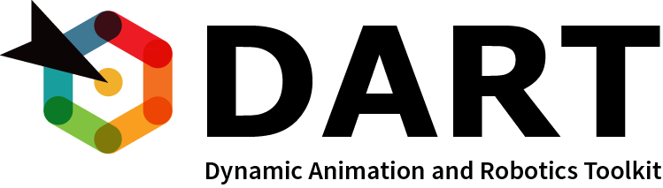

# Welcome to DART

DART (Dynamic Animation and Robotics Toolkit) is a collaborative, cross-platform, open source library created by the Georgia Tech Graphics Lab and Humanoid Robotics Lab. The library provides data structures and algorithms for kinematic and dynamic applications in robotics and computer animation. DART is distinguished by its accuracy and stability due to its use of generalized coordinates to represent articulated rigid body systems and Featherstone's Articulated Body Algorithm to compute the dynamics of motion. For developers, in contrast to many popular physics engines which view the simulator as a black box, DART gives full access to internal kinematic and dynamic quantities, such as the mass matrix, Coriolis and centrifugal forces, transformation matrices and their derivatives. DART also provides efficient computation of Jacobian matrices for arbitrary body points and coordinate frames. The frame semantics of DART allows users to define arbitrary reference frames (both inertial and non-inertial) and use those frames to specify or request data. For air-tight code safety, forward kinematics and dynamics values are updated automatically through lazy evaluation, making DART suitable for real time controllers. Contacts and collisions are handled using an implicit time-stepping, velocity-based LCP (linear-complementarity problem) to guarantee non-penetration, directional friction, and approximated Coulomb friction cone conditions. For collision detection, DART uses FCL developed by Willow Garage and the UNC Gamma Lab. DART has applications in robotics and computer animation because it features a multibody dynamic simulator and tools for control and motion planning. Multibody dynamic simulation in DART is an extension of RTQL8, an open source software created by the Georgia Tech Graphics Lab.

DART is fully integrated with Gazebo 2.0, a multi-robot simulator for outdoor environments. DART supports most features provided in Gazebo, including the link structure, sensor simulation, and all the joint types. DART also supports models in URDF, SDF, and VSK file formats.
